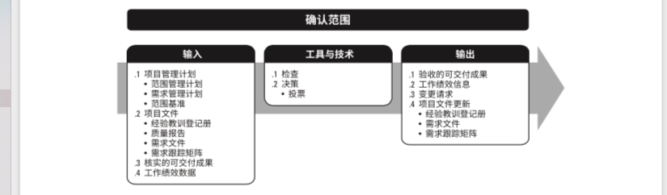

工作包

- 工作包是WBS最底层的组件，可对其进行成本和持续时间进行估算和管理
- 从逻辑角度上讲，不能再分下去了。(已经是最小的螺丝钉了)
- 其能够比较快的完成
  - 80小时原则。
  - scrum敏捷方法中以sprint方式展现
- 能够被外包出去。

WBS的100%原则：

子层级上的工作总和应100%完全等于母层次的工作。

控制账户：

- 控制账户是将范围、预算 进度加以整合，并与挣值比较，以测量绩效的管理控制点。
- 每个工作包 分配 到一个控制账户，且只能被分配到一个。
- 每个控制账户都可以包括两个或多个工作包。
- 控制账户可以包含一个或多个规划包。

对于远期的可交付成果或组件，当前可能无法分解。规划包是低于控制账户 而高于工作包的WBS组件，工作内容已知， 但详细的活动进度未知。 规划包提现了滚动式规划与渐进明细的精神。

### 5.4.3 输出

- 范围基准

  - 项目范围说明书
  - WBS 
  - WBS词典-(是针对WBS中的每个组件，详述可交付成果、活动和进度信息的文件，WBS词典对WBS提供支持。)
    - 账户编码标识
    - 工作描述
    - 假设条件和制约因素
    - 负责的组织
    - 进度里程碑
    - 相关的进度活动
    - 所需资源
    - 成本估算
    - 质量要求
    - 验收标准
    - 技术参考文献
    - 协议信息

  - 工作包
  - 规划包

- 项目文件更新

  - 假设日志  - 随同本过程识别出更多的假设条件或制约因素而更新假设日志
  - 需求文件 -  可以更新需求文件，以反映在本过程提出并已被批准的变更

  

  

  几个和范围相关的文件比较：

## 5.6 控制范围

过程定义：

监督项目和产品的范围状态，管理范围基准变更的过程。

未经控制的产品和范围项目的扩大，被称为项目蔓延， 项目蔓延是项目镀金的一种形式，PMI主义反对镀金。

控制范围的重要工作就是：

- 确定偏离范围基准的程度 和 原因。
- 决定是否需要采取纠正或预防措施

### 5.6.1 输入

项目管理计划

- 范围管理计划

  - 需求管理计划

  - 变更管理计划

  - 配置管理计划

  - 范围基准

  - 绩效测量基准

- 项目文件

  - 经验教训登记册
  - 需求文件
  - 需求跟踪矩阵

- 工作绩效数据
- 组织过程资产

### 5.6.2 工具与技术

- 数据分析
  - 偏差分析 -- 针对现状 （审查基准和实际结果，看是否有必要采取纠正或预防措施）
  - 趋势分析 - 针对未来， 审查项目绩效随时间的变化情况，判断绩效是正在改善还是恶化。

### 5.6.3 输出

- 工作绩效信息
- 变更请求
- 项目管理计划更新
  - 范围管理计划
  - 范围基准
  - 进度基准
  - 成本基准
  - 绩效测量基准

- 项目文件更新
  - 经验教训登记册
  - 需求文件
  - 需求跟踪矩阵

## 5.5 确认范围 - （可以称 核实范围）

过程定义： 

**正式验收**已完成的项目可交付成果的过程。 其是实质性验收， 在监控过程组。

过程作用：

使验收过程具有客观性，同时通过确认每个可交付成果，提高最终产品、服务或成果获得验收的可能性。

由客户或发起人审查从控制质量过程输出的核实的可交付成果，确认这些可交付成果已经圆满完 成并通过正式验收

确认范围和前后过程的关系：

### 5.5.1 输入

- 核实的可交付成果- （已完成，并被控制质量过程检查为正确的可交付成果，也就是先通过内部的质量检测合格，然后再交付给外部的可交付成果）

- 工作绩效数据
  - 符合需求的程度
  - 不一致的数量 （BUG）
  - 不一致的严重性 - BUG

### 5.5.2 工具和技术

- 检查 -  是指开展测量 审查 和确认活动，来判断工作和可交付成果是否符合需求和产品验收标准。又可以称为 审查 产品审查   巡检
- 决策 。 包括但不限于 
  - 投票 （可以是 一致同意   大多数同意 相对多数同意）

### 5.5.3 输出

- 验收的可交付成果
  - 符合验收标准的可交付成果，应该由客户或发起人正式签字批准。
  - 这些文件应该提交给结束项目或阶段过程。

- 工作绩效信息
  - 哪些已经被验收
  - 哪些未被验收，及其原因

- 变更请求

  - 可能需要针对某些可交付成果提出变更请求，进行缺陷补救。

- 项目文件更新

  - 经验教训登记册
  - 需求文件
  - 需求跟踪矩阵

  