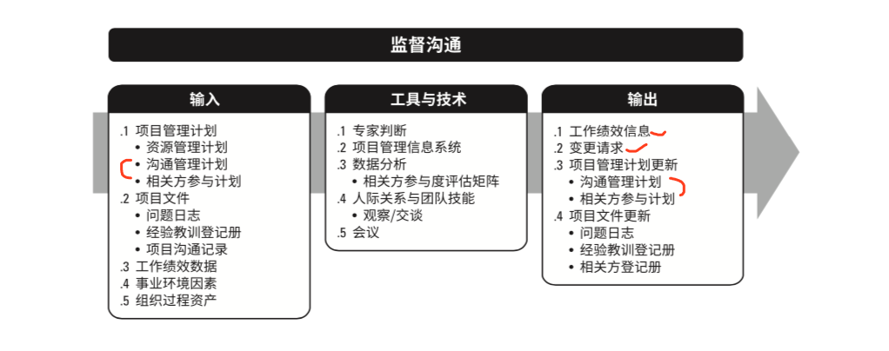

# 10  项目沟通管理

项目沟通管理包括 为通过开发沟通攻坚， 以及执行用于有效交换信息的各种活动， 来确保项目及其干系人的信息需求得以满足的各个过程。

项目经理在大多数时间都用在团队成员和其他干系人的沟通上。

有效的沟通能在各种各样的项目干系人之间架起一座桥梁。

有效的沟通活动 和工件创建的基本属性：

- 沟通目的明确
- 尽量了解沟通接收方，满足其需求偏好。
- 监督并衡量沟通的效果。

日常沟通中三种信息传递方式：

- 语言文字 7%
- 动作 、神情、眼神。   55%
- 语气语调    38%

书面沟通的5C原则：

正确的语法和拼写

简洁的表述和无多余文字

清晰的目的和表述  

连贯的逻辑思维 

受控的语句和想法承接。 (承上启下)

**敏捷/适应性环境的考虑因素：**

减少获取信息的通道

集中办公

以透明的方式发布项目工作

过程构成：

## 10.1  规划沟通管理

过程定义：

基于干系人或干系人群体的信息需求、可用的组织股熬成资产 以及具体的项目需求， **为沟通过程制定恰当的方法和计划的过程**。

应该尽可能早地开展沟通规划工作。

在**整个项目期间**，  **定期审查**规划  规划沟通管理过程的成果(**沟通管理计划**)并作必要的修改， **确保其持续适用**。

**沟通需求分析：**

确定项目干系人的信息需求，包括所需信息的类型和格式，以及信息对干系人的价值。常需要参考如下信息：

- 干系人登记册、 干系人参与计划中的 干系人信息 及沟通需求。
- 潜在的沟通渠道 和途径数量。
- 组织结构图。
- 项目组织和干系人之间的职责、关系、依赖。
- 开发方法
- 法律要求
- 内部信息要求 （何时在组织内部沟通）
- 外部信息要求(何时与媒体、公众 承包商沟通)
- 。。。

沟通渠道数量 =  N*（N-1） /2     N是团队成员数量

**沟通技术：**

电话、 会议、 书面文件、 数据库， 社交媒体 和网站 等。

影响沟通技术选择的因素包括：

- 信息需求的迫切性
- 沟通技术的可用性和可靠性
- 易用性
- 项目环境。
- 信息敏感 保密性。

当今时代影响最大的沟通技术是 互联网技术， 尤其是移动互联网技术。

**沟通模型：**

编码  =---（噪声）== 传递信息 ===--(噪声)==》 解码

沟通过程中的信息失真：

沟通障碍导致信息的延误或曲解。

过滤： 信息在自上而下或自下而上沟通过程中  损失掉的现象。

**沟通方法：**

- 互动沟通
- 推式沟通
- 拉式沟通
- 

**人际关系与团队技能**：

- 沟通风格评估 - 识别偏好的沟通方法， 常用与不支持项目的干系人
- 政治意识 
- 文化意识 -- 认识到个人、群体 和组织之间文化的差异

 **沟通管理计划：**

是项目管理子计划之一，描述了如何对项目沟通进行规划，结构化，实施与监督，以提高沟通的有效性。 包括了如下信息：

- 各种干系人的沟通需求
- 需要沟通的信息。 包括语言 、格式、内容、详细程度等。
- 上报流程
- 通用术语表
- 沟通制约因素。
- 等

项目执行过程中，如果有沟通问题，通常应该检查沟通管理计划。

## 10.2 管理沟通

过程定义： 确保项目信息 及时 恰当的收集 生成  发布 存储 检索  管理 监督 和最终处置的过程。

过程作用：促进项目团队和干系人之间实现有效率及有效果的信息流动。

输入中比较重要的：  

1计划(沟通管理计划)    

2 日志(问题日志 变更日志)     

2册子(相关方登记册  经验教训登记册)   

3报告(质量报告  风险报告   工作绩效报告)

**项目报告：**

项目报告是收集并发布项目信息的行为。项目报告要发布给众多的干系人群体。

应该针对不同的干系人调整发布报告的适当层次、格式、细节。

虽然工作绩效报告是监控项目工作的输出，但本过程会编制临时报告、项目演示、等。

**项目沟通记录：**
包括： 绩效报告、 可交付成果状态、进度进展、 已发生的成本、演示 以及干系人需要的其他信息。

**组织过程资产更新：**

- 项目记录

- 计划内 的和临时的 项目报告和演示

  

## 10.3 监督沟通

确保满足项目及其干系人的信息需求的过程。

过程作用：  按照沟通管理计划 和干系人参与计划的要求优化信息传递流程。

本过程可能触发规划沟通管理和管理沟通过程的迭代，以便修改沟通计划 提升沟通效果。

问题  KPI  风险 和 冲突 都可能触发该修改。

