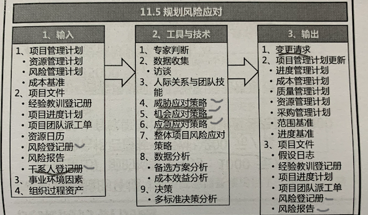

# 11 项目风险管理

墨菲定律：

越怕出事， 越会出事。  如果有两种以上选择， 其中一种将导致再难后果，必定有人会做出这种选择。

项目风险 是一种不确定的事件 或者  条件， 一旦发生 将对一个/多个项目目标产生 积极或者消极影响。

项目风险源于任何仙姑都存在不确定性。不确定性是项目环境的显著特征。

项目的独特性  导致 项目充满风险。

已发生的消极风险， 可视为问题。 

风险的四要素：  起因  事件    **概率  影响**。 

风险管理的目标在于 **提高**项目中**正面风险的概率和影响**，  **降低**项目中 **负面风险的概率和影响** ，从而提高项目成功的可能性。

组织应该以可控的方式去冒风险。

风险分为：

- 单个项目风险 ，一旦发生，会对一个或多个项目目标产生正面或负面影响的不确定事件或条件
- 整体项目风险， 是各种不确定性对项目整体的影响

过程构成：

## 11.1 规划风险管理

定义如何实施项目风险管理活动的过程。

风险管理计划 在项目构思阶段就开始， 应在项目规划阶段早期完成。

**干系人分析：**

通过干系人分析确定项目干系人的风险偏好

**风险管理计划**：

是项目管理子计划之一， 描述了如何安排和实施风险管理活动， 内容包括：

- 干系人风险偏好
  - 风险偏好 是 为了预期的回报 ， 组织或个人 愿意承担不确定性的程度。风险偏好 可以用效用函数来描述。
    - 风险厌恶者
    - 风险追求者
    - 风险中立者
  - 风险敞口 --- 某一个时间点的风险大小
  - 风险临界值，  高于该级别的要处理， 低于的可接受。

- 方法论
- 风险概率影响定义(用来定义风险大小)
  - 
- 

- 概率和影响矩阵 (可以快速的定位是是高风险 中风险 还是 低风险)
  - 

- 资金
- 风险类别 ， 规定对潜在风险的分类方法。  风险分解结构 是按风险类别排列的一种层级结构。 常见的有两种
  - 
  - 

- ...

## 11.2 识别风险

识别单个项目风险 及 整体项目风险的来源， 并记录其特征的过程

**SWOT分析：**  

识别风险的一个典型的工具

**提示清单：**

和核对单有区别， 其不明确，就是一个警示， 战略  宏观。  是一个提示风险的预设清单。

**风险登记册：**

本过程形成了第一版的风险登记册， 详细信息包括：

- 已识别的风险的清单
- 潜在的责任人
- 潜在风险应对措施清单
- 其他信息(风险名称 风险类别  时间信息    当前风险状态  受影响的WBS组件等)

**风险报告：**

风险报告是关于项目整体风险的信息， 关于已识别的单个项目风险的概述信息。 (--宏观)，可能包括：

- 整体项目风险的来源
- 已识别的单个项目风险的概述信息。
  - 数量
  - 类别及风险在风险类别中的分布情况
  - 测量指标
  - 发展趋势

## 11.3 实施风险定性分析

主要是评估风险的概率、影响，  对风险进行优先级排序。（概率 * 影响 得到一个参考值， 并通过参考值进行排序）

本过程会识别出 每个风险的  风险责任人， 有他们来负责规划风险应对措施，并确保其实施。

**风险数据(的)质量评估**：

风险数据是开展定性风险分析的基础。  可以通过计算各方面的加权平均数 作为数据质量的总体分数。

**风险概率和影响评估**（评估风险的概率和影响）：

对已识别的每个风险都要进行概率和影响评估。

其他风险参数评估(主要是紧迫性)

**风险分类：**

对项目风险进行分类，以确定 哪些项目领域最容易被风险和不确定性影响。

- 按风险来源-- 如使用RBS
- 按照受影响的工作 -- 如使用WBS
- 其他分类标准--- 阶段   预算、  角色和职责 等

风险可以根据共同的根本原因进行分类。

风险分类有助于把注意力和精力集中在 风险敞口最大的领域，  或者 针对一组相关的风险 指定通用的应对措施，  有利于更有效的开展风险应对。

**概率和影响评估：**

主要是概率和影响矩阵的使用。

**层级图：**

对两个以上的参数进行分类，  需要使用其他图形， 如： 气泡图

**风险登记册更新：**

- 对每个风险的概率和影响评估
- **优先级** 或 风险分值。
- 指定的 **风险责任人**。
- 风险紧迫性 或者 风险类别
- 观察清单(低风险)

**风险报告更新：**

- 记录 最重要的单个项目风险， 所有已识别的风险优先级顺序 以及简单的结论

## 11.4 实施风险定量分析

量化整体敞口风险， 并提供额外的定量分析信息，以 支持风险应对规划。最终得到的影响是一个具体值

并非所有项目都需要 风险 定量分析， 他最可能适用 大型或复杂项目  具有战略重要性的项目等。

定量分析是评估整体项目风险的唯一可靠方法。

**访谈**：

通过向专家访谈可以获得定量风险分析的输入。

**模拟：**

通常采用蒙特卡洛分析。 常用语 成本风险分析    进度风险分析。

**敏感性分析：**

有助于确定哪些风险对项目具有最大的潜在影响。   典型表现就是  龙卷风图。

优点： 简单 经济 有助于理解

缺点： 没有给出概率，  没有考虑各个不稳定项目变量之间的关系。

**决策树分析**：

是对所考虑的决策以及 采用这种方案可能带来的后果进行描述的一种图解方法。

决策树的求解过程可得出每项方案的预期货币价值（EMV）。 EMV 是对概率 和影响综合量化的一种技术， 机会的EMV为正。  威胁的EMV为负。

不检测：     50 * 0.04 * 35000

检测:    50 *0.04 * （1000+2300） + 50 * 0.96 * (1000+200)

**风险报告的更新：**

单个项目风险优先级清单。

所需的应急储备

风险应对建议

## 11.5 规划风险应对

过程作用： 制定应对整体项目风险和单个项目风险的适当方法。

最优的风险应对措施 应从备选方案中加以选择

需要考虑风险应对的 主要策略 备用方案  应急计划 弹回计划  次生风险  应急储备等。

**威胁应对策略：**

- 上报 -如果认为威胁不在项目范围内， 或者超过了项目经理的权利

- 规避 - 采取行动消除威胁，概率降低为0  消除威胁。 （消除威胁的原因 延长进度计划  改变项目策略 缩小范围 等）
- 转移 - 威胁的责任转移到第三方。  如：外包
- 减轻 - 降低概率或影响。 （采用简单的流程， 更多的测试  更可靠的供应商  加入冗余部件 等）
- 接受 - 承认风险的存在， 不采取任何应对策略。(主动： 建立应急储备， 等待危险到来，   被动： 不采取任何措施)

**机会应对策略：**

- 上报
- 开拓 - 概率提高到100%
- 分享 - 转移给第三方，让其享有部分收益。 
- 提高  - 提高发生的概率或影响。
- 接受 -  不主动采取任何措施

 

**整体项目风险应对策略：**

开拓     规避    转移/分享   减轻 /提高    接受

**决策：**
如果在原定的应对策略被证明为无效，  可在项目后期采用不同的应对策略(弹回计划)

**风险登记册更新**：

- 商定的应对策略
- 试试策略所需的行动
- 风险发生测出发条件、 征兆  预警信号
- 应急计划 和 启动应急计划的触发条件
- 残余风险  -- 采取措施后 仍然存在的风险
- 次生风险 -  实施风险应对措施后 出现的新的风险

**风险报告更新:**

记录商定的应对措施

## 11.6 实施风险应对

执行商定的风险应对计划的过程。

只有风险责任人 以 必要的努力去实施商定的应对措施， 项目的整体风险敞口  和 单个威胁及机会才会得到主动管理。

## 11.7 监督风险

监督风险需要判断：

- 实施的防线应对是否有效。
- 实施项目风险级别是否已改变
- 已识别的单个项目风险的状态是否已改变
- 风险管理方法是否依然使适用
- 风险管理政策和程序是否已得到遵守
- 成本或进度应急储备是否需要修改
- 项目策略是否仍然有效。

**技术绩效分析**：

把项目执行期间取得的技术成果 和 项目计划所实现的成果进行比较。

实际结果的偏差可以代表 威胁或 机会的潜在影响

**储备分析**：

在项目的任意时点 ， 比较剩余应急储备 与 剩余风险量，从而确定剩余储备是否依然合理

**审计 ：**
评估风险管理过程的有效性， 可按照计划规定的频率开展风险审计

**会议：**

- 风险审查会， 评估风险应对措施的有效性。   风险再评估（发现新风险、识别过时风险  评估当前风险）

**变更请求**：

- 应急计划-  实现计划好，当接受的风险发生时， 所采取的措施
- 权变措施 -  发生以往未曾识别的风险， 采取的应对措施。  权变措施 和应急计划不同， 其未事先安排。

