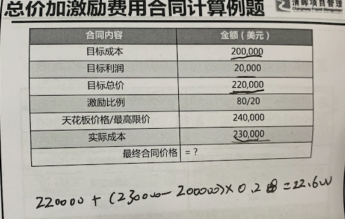
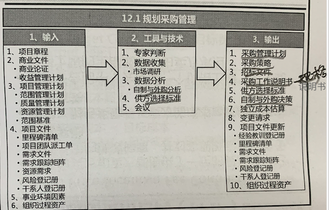
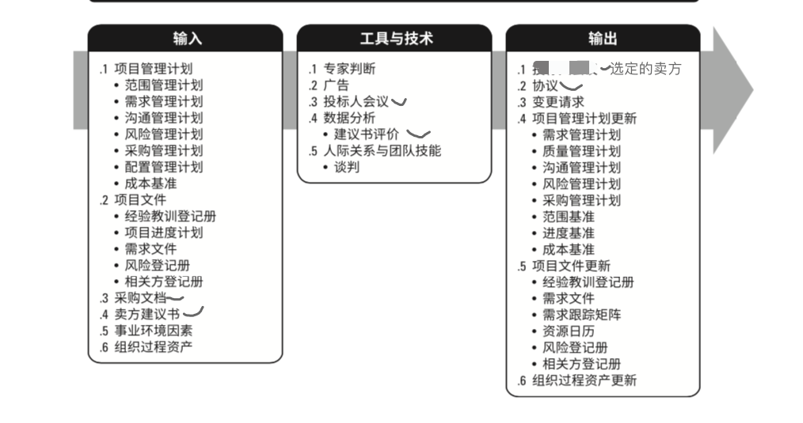
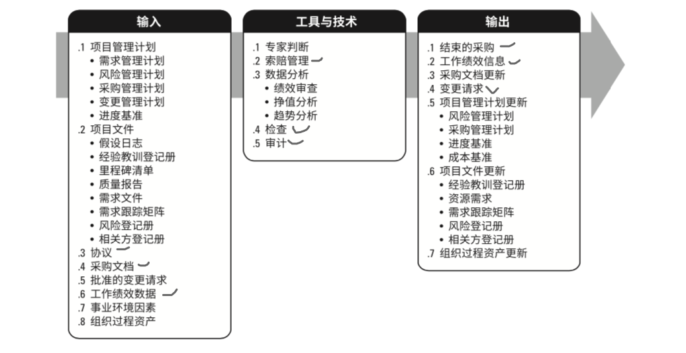

# 12 项目采购管理

过程定义：

明确采购方法、 记录项目采购决策、识别潜在卖方的过程。

货物或服务 可以从其他部门采购 或者从 外部渠道采购。

在规划采购早期，确定和采购相关的角色与职责，配备专业采购人员。

经典的采购步骤：

- 准备采购工作说明书(SOW) 或工作大纲(TOR)
- 准备高层及的成本估算 ，制定预算。
- 发布招标广告
- 确定合格卖方名单
- 准备和发布招标文件
- 卖方提交建议书
- 对建议书开展技术(包括质量)评估
- 对建议书开展成本评估
- 逐步最终的综合评估报告， 选出中标建议书
- 结束谈判， 签署合同

常见的合同类型：

- 总价合同(范围明确，工程量明确，不会出现重大变更)

  - 固定总价合同

  - 总价加激励  允许一定的绩效偏离， 并对实现目标给与财务激励。 不过会设置一个价格上限，超过价格的全部成本由卖方承担。例如买卖双方按照80/20的比例分担成本偏差。

    - 实际价格计算公式(从卖方的角度看)：目标成本+ (实际成本-目标成本)*0.2 +目标利润   然后和 限制价格取个最小值。

      

  - 总价加经济价格调整  项目持续几年， 合同以不同货币支付价款。

- 工料合同 (范围明确，工程量不确定)

- 成本补偿合同 (开始时无法定义准确范围，会在后续发生重大变更)

  - 成本加固定费用
  - 成本加激励 （类似总价加激励 ，但是没有最高限价）
  - 成本加奖励

对于卖方来说， 成本风险从高到底。  买方，反之。

**需求文件：**

- 卖方需要满足的技术需求

- 具有合同或法律意义的需求。(健康 安保  环境   许可证 知识产权  等)

**资源需求**：

略

**事业环境因素：**

- 市场条件

**组织过程资产：**

- 预先批准的卖方清单

- 采购政策 程序 指南

- 组织所使用的的合同类型

**自制与外购分析**：

用来确定某项工作最好由项目团队自行完成， 还有应该从外部采购

**供方选择分析**：

应该在采购文件中写明评估方法，让投标人了解被如何评估。

常用选择方法：

- 最低成本
- 仅凭资质
- 基于质量和成本
- 唯一来源
- 固定预算

采购管理计划：

包含要在采购过程中开展的各种活动

**采购策略**：

- 交付方法
- 合同支付类型
- 采购阶段

**招标文件**：

招标文件用于向潜在卖方征求建议书。 建议邀请书， 主要是针对项目型采购，关于解决方案。

**采购工作说明书：**

SOW，包括 规格 所需数量 质量水平  性能参数 履约期限  工作地点和其他要求。

在采购过程中， 应根据需要对SOW进行修订和改进， 只到成为所签订合同的一部分。

如果和供应商发生了扯皮， 首选 合同作为参考， 其次 SOW。

**供方选择标准**：

标准可以是主观或客观的。 包括： 能力  成本 交付日期 技术专长  经验 员工资质   管理经验等，

这些标准是甲醛系统的组成部分， 可以依据此加权打分 排列所有建议书的顺序，以确定谈判的顺序，并和某个卖方签订合同。

   

自制与外购决策：

略

独立成本估算：

对于大型的采购， 采购组织可以自行准备独立估算， 作为评价卖方保价的对照基准。

## 12.2 实施采购

**投标人会议**：

又称为供应商会议  供货商会议 投标前会议。

是在投标书 或 建议书提交之前 和所有卖方之间召开的会议。

会议的目的是保证所有潜在卖方 对采购要求都有清楚一致理解， 保证没有任何投标人会得到特殊优待。

为了公平起见， 买方必须尽力确保卖方的的问题 都得到回答。

**建议书评价**：

可采用多维度的加权评分机制（多标准决策分析）

**选定的卖方**：

根据建议书或者 投标书评价中被判断 最有竞争力的投标人。

**协议**：

合同

## 12.3 控制采购

确保买卖双方履行合同义务，满足项目需求。

管理采购关系 ，监督合同绩效， 实施必要的变更和纠偏。

**工作绩效数据**：

包含和项目状态有关的卖方数据

**索赔管理**：

如果合同双方无法自行解决索赔问题，可能不得不按照合同中的规定程序，用替代争议解决(ADR)方法去处理。

谈判是解决所有索赔和争议的首选方法

数据分析：

- 绩效审查，发现供应商履约情况的好坏
- 挣值分析
- 趋势分析

检查 & 审计 ：

略

**采购关闭**：

买房通过采购员向买房书面通知已经完成了合同。

**工作绩效信息**：

是卖方正在履行的工作的绩效情况。包括和合同要求进行比较的完成情况。以及和SOW预算相比较的已完成工作的成本产生和认可情况。

 

