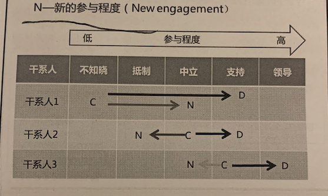

# 13  项目干系人管理

包括了如下过程：

- 识别可能影响项目或者受项目影响的全部人员 群体  组织
- 分析干系人对项目的期望和影响
- 执行合适的管理策略有效调动干系人参与项目决策与执行。

把干系人满意度作为一个关键的项目目标加以识别和管理

干系人管理还关注与干系人的持续沟通， 以便：

- 了解干系人的需要和期望
- 解决实际发生的问题
- 管理利益冲突
- 促进干系人合理参与项目决策和活动。

对于敏捷的考虑因素：

- 项目团队和干系人直接互动
- 敏捷方法提倡高度透明

## 13.1 识别干系人

过程定义：

定期 识别 干系人， 分析和记录他们的 利益、 参与度。 依赖性  影响力 和对项目成功的潜在影响的过程。

过程作用：

使项目团队 建立 对 每个干系人/干系人群体的适度关注。

本过程通常在编制和批准项目章程之前或者 同时首次开展。

在必要时重复开展， 至少每个阶段开始前， 以及 项目或组织发生重大变化时重复开展。

**干系人分析：**

产生干系人清单 以及 各种信息(组织位置、利害关系、 角色、 期望 态度、 对项目兴趣程度)

利害关系包括：  利益    权利  所有权    知识    贡献（提供资金或其他无形资源）

**干系人映射分析/表现：**(对干系人反洗的结果进行展现)

- 权利/利益方格 （**令其满意 重点管理   监督 随时告知**）

- 权利/影响方格
- 凸显模型 （常用与**复杂**的**大型**社区，可用于确定已识别相关方的相对重要性）
- 影响方向

- 优先级排序

**干系人登记册：**

用于记录已识别的干系人的所有详细信息。  包括但不限于：

- 身份信息
- 评估信息 （主要需求  期望  对项目的影响力  主要影响项目的那个阶段）
- 干系人分类(内部/外部  作用/影响/权利/利益  上级下级向外 横向。 或其他分类模型。)

应该定期审查干系人登记册， 因为整个项目生命周期中干系人可能发生变化，也可能识别出新的干系人。

干系人登记册中并没有说什么时候给干系人发报告。(这部分信息在沟通管理计划中)

## 13.2  规划干系人参与

过程定义：

根据干系人需求 期望  影响， 制定干系人参与项目方法的过程。

过程作用：

提供与干系人进行有效互动的可行性计划。

大多数干系人不能被项目经理直接。管理， 项目经理能管理的是他们的参与

在通过识别干系人明确最初的干系人社区后， 就应该编制最初的干系人参与计划， 后续定期更新计划。

触发该计划更新的经典情况：

- 新阶段开始
- 组织结构 或 行业内部发生变化。
- 干系人成员发生变化
- 其他项目过程领域的输出 导致需要重新审查干系人参与策略。

**干系人参与度评估矩阵：**

干系人的参与对项目成功至关重要。

应该比较所有干系人的当前参与水平和期望参与水平

参与水平分类：

- 不知道
- 抵制型
- 中立性
- 支持型
- 领导型

备注： C 是当前参与程度  D是期望参与程度。

**干系人参与计划：**

其是项目管理子计划之一， 用于促进干系人有效参与决策和执行的策略和行动。通常包括：

- 关键干系人当前参与程度 和期望测参与程度
- 干系人沟通需求 与 沟通方法。

项目经理应该注意到干系人参与计划的敏感性，采取恰当的预防措施

-  抵制态度干系人的信息  可能具有潜在破坏作用， 这类信息的发布要特别谨慎。

## 13.3 管理干系人参与

过程定义：

和干系人打交道，满足其需求和期望， 促进干系人合理参与的过程

过程作用：

让项目经理提高干系人的支持， 并尽可能降低干系人的抵制。 

管理干系人参与中， 需要开展多种活动：

- 适当时机，调动相关方参与，以便获取、确认或维持他们对项目成功的持续承诺
- 通过谈判和沟通， 管理关系人期望
- 澄清和解决已识别的问题。
- 参与变更处理流程
  -  尽量避免主观变更
  - 客观需要变更的时候，促使干系人打成共识

**基本规则：**

根据团队章程中定义的基本规则， 来明确团队成员和其他干系人应该参与什么行为引导干系人参与

**干系人登记册更新：**

当识别出新的干系人需求， 或者需要对干系人的需求进行修改时候， 就需要更新。

当需要处理关注点和解决问题时， 也需要更新。

## 13.4 监督干系人参与

随着项目进展和环境变化， 维持或提升干系人参与活动的效率和效果。

**根本原因分析**：

确定干系人参与未达到预期效果的根本原因

**干系人参与度评估矩阵更新：**

