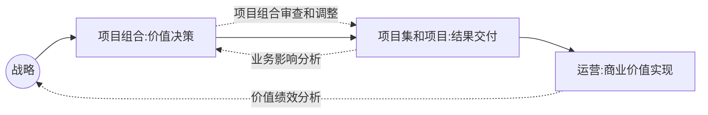
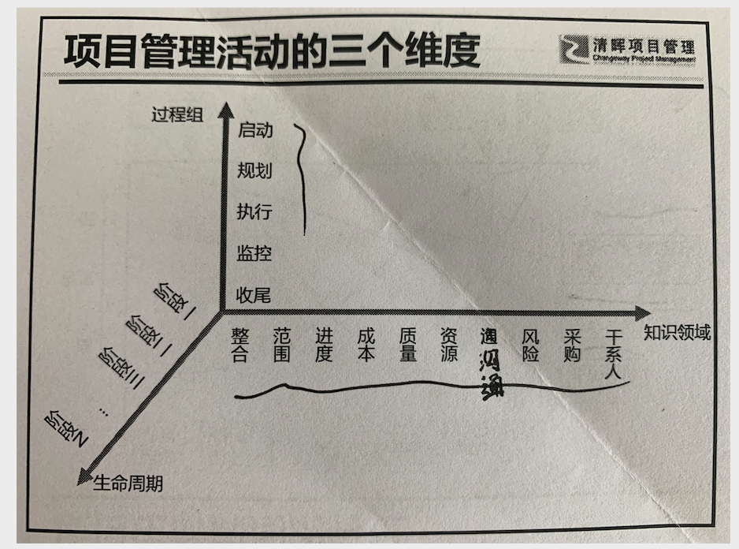
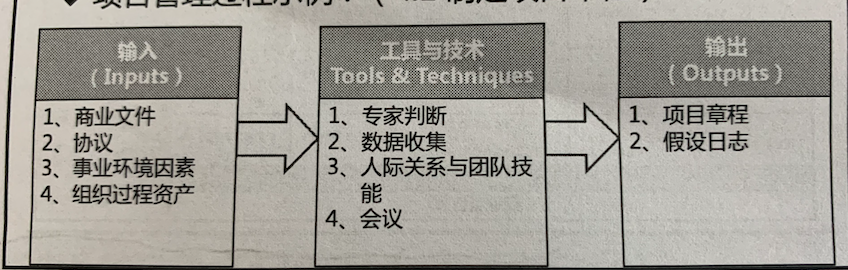

# 1 引论

## 1.1  hello PMP

### 1.1.1 术语

在清辉讲义中，为了方便理解 和遵从习惯。 对于专业术语进行了优化：

- Stakeholder  干系人，指代 相关方。
- Benefit 收益， 指代 效益 毛收入。

### 1.1.2 常见认证类课程

- PMP  项目管理资格认证
- ACP  敏捷项目管理认证
- NPDP 产品精力认证
- 软考  计算机技术与软件专业资格水平考试
- PBA 商业分析师资格认证
- PgMP  项目集管理资格认证

### 1.1.3 学习PMP的收获

- 【传承】思想
- 变革【创新】
- 系统框架(【**5** 大过程组 + **10** 大知识领域】)
- 过程工具(【**49**个项目管理过程 + **132 **个项目管理工具与技术 】)

### 1.1.4 项目管理的学科奠基人

- 费里德里克 - 泰勒 (科学管理奠基人)
- 亨利 - 甘特 (项目管理奠基人，甘特图的发明人)

### 1.1.5 清辉管理的三原则

- 目标管理
  - 目标管理的三个步骤
    - 建立切实可行的目标
    - 目标分解 及 阶段性度量
    - 实施纠错 直至实现目标
  - 制定目标的SMART原则
    - Specific 明确性
    - Measurable 衡量性
    - Attainable 可执行性
    - Relevant 相关性
    - Time-based 时限性
- PDCA
  - PLAN (做计划)
  - DO  （实施）
  - CHECK （检查）
  - ACTION (实现激励机制，总结经验 制定目标)
- 以人为本 (现代企业家应该向这个方向发展)

## 1.2.基本要素

### 1.2.1 项目

#### 定义

项目是为了创造独特的产品 服务 成果 而进行的临时性工作

项目可以创造：
- 一个独特的产品
- 一种独特的服务或提供服务的能力
- 一项独特的成果
- 一个或者多个产品 服务 成果 的独特组合

#### 项目具备的两大特性：

- 独特性 （Unique）
  - 项目创造独特的可交付成果(Deliverable)
  - 项目某些地方重复 不改变项目本身独特性。(比如同样是开发一个网页)
  - 独特性导致不确定性 和风险
  - 独特性使项目需要比常规工作更要精心规划
- 临时性 (Temporary)
  - 有明确的起点和终点
  - 但是时间不一定短
  - 很多项目的结果或者影响具备持久性(金字塔)

####  项目的一个核心思想

- 渐进明细 （随着信息越来越具体，估算越来越准确， 而持续改进和细化项目管理计划.
如 渐进式规划项目）

#### 项目的制约因素

传统的三种制约：(核心点： 质量)
- 范围
- 时间
- 成本

现代的多重制约 （核心点： 干系人/相关人 满意）
- 范围
- 进度
- 预算
- 质量
- 资源
- 风险

####  项目驱动变更

对组织来说，从商业看，项目为了推动组织从一个状态转到另一个状态，从而达成特定目标。
(如： 公司利用一个项目，达成了从初创到上市)

#### 项目创造商业价值

项目的商业价值指特定项目的成果能够为干系人带来的收益

附加说明：

- 对持续运营的有效管理也可以创造商业价值 （如运营 销售）
- 对项目的投资可以提升创造商业价值的能力 （如：软件更新迭代）

####  项目价值的分类 (实现难度从低到高)

- 基础价值 
  - 内部价值 
  - 财务价值 
- 战略价值 
  - 客户相关价值 
  - 未来价值 

#### 项目启动的四大基本场景

- 满足干系人的要求或需求
- 符合法律 法规 或者社会要求
- 创造改进 修复产品或服务
- 执行、变更商业或者技术战略

### 1.2.2 项目管理的重要性

#### 项目管理的定义

项目管理是将知识 技能  工具和技术应用于项目活动，以满足项目的要求。（或者可以说 客户的需求）
#### 如何实现

通过合理利用 整合 49个项目管理过程得以实现。

有效和高效的项目管理应被视为组织的战略能力。它使组织能够：
- 将项目成果与业务目标联系起来
- 更有效地开展市场竞争
- 支持组织发展
- 适当调整项目管理计划，以应对商业环境改变给项目带来的影响

### 1.2.3  项目、项目集、项目组合以及运营管理之间的关系

#### 1.2.3.1 概述

项目集不是大项目。规模特别大的项目称为“大型项目”。一般定 义，大型项目通常需要 10 亿美元或以上的成本，可影响上百万人，并且将持续数年

- 项目集和项目管理的重点在于以“正确”的方式开展项目集和项目
- 项目组合管理则注重于开展“正确”的项目集和项目

#### 1.2.3.2 项目集管理

##### 项目集定义

项目集 是一组相互关联被协调管理的项目 、子项目集 和项目集活动。以便获得分开管理无法获得的利益。

##### 项目集管理重点关注

- 项目间的依赖关系
- 找到管理这些依赖关系的方法， 具体措施包括：
  - 解决项目集内的资源制约/冲突
  - 与对项目集有影响的组织/战略方向保持一致
  - 处理同一个治理结构内相关问题和变更管理

#### 1.2.3.3 项目组合

##### 项目组合定义

项目组合是指为了实现战略目标而组合在一起的项目、项目集、子项目组合 和运营工作。

- 项目组合中的项目不一定有依赖关系或者相关

##### 项目组合管理重点关注

- 通过审查项目、项目集  确定资源分配的优先级 

-  确保对项目组合的管理 和组织战略保持一致 

##### 项目组合相关层级关系举例

- 项目组合 --  举办奥运为
  - 项目集 -  奥运场馆建设
    - 项目 - 羽毛球馆建设
      - 子项目 1 - 主体结构建设
      - 子项目2  --座位建设
      - 子项目3  --给排水建设
      - ..

#### 1.2.3.4 运营管理

略

#### 1.2.3.5 运营与项目管理

##### 运营的定义

运营是支撑日常业务，实现业务战略和战术目标的手段。

如：生产  制造 会计  软件支持 运行维护  等

项目与运营在产品生命周期的不同时点交叉：

- 新产品开发 产品升级 提高产品时
- 改进运营 /产品开发流程时
- 产品生命周期结束阶段
- 在每个收尾阶段

在每个交叉点， 可交付成果及知识在项目和运营之间转移，以完成工作交接。(项目转移到运营 OR 运营转移到项目)

##### 运营的两大特性

持续性、 重复性

#### 1.2.3.6 组织级项目管理(OPM)与战略

##### 组织级项目管理定义

组织级项目管理(OPM)是把项目、项目集和项目组合管理的原则与实践与组织驱动因素
(OE,如：人力 技术 等)联系起来，从而提升组织能力，支持战略目标。

##### 相关的几个小概念 (自顶向下的几个概念)

 - 愿景 （做好自己， 比如：阿里巴巴：做一个百年企业）
 - 使命 （帮助他人， 比如：阿里巴巴：让天下没有难做的生意）
 - 组织战略与目标
 - 项目组合、项目集与项目

##### 组织级项目管理流程图

 

#### 附： 项目管理活动的三个维度

如下图所示：(图中那两个字 是 **沟通**)

### 1.2.4  指南的组成部分

#### 1.2.4.1 项目和开发生命周期

##### 项目生命周期定义

是指项目从启动到收尾的一系列阶段

- 阶段通常按照 **顺序排列**
- 阶段**数量 因项目而异**
- 阶段 **有时间限制**
- **阶段 = 小项目**，有明确起点 和 重点

组成项目生命周期的各个阶段 可以 顺序  迭代 或者交叠进行。

##### 通用的项目生命周期结构( 4阶段 )

- 启动项目 
- 组织和准备 
- 执行项目工作 
- 结束项目

##### 常见的项目生命周期类型

- 预测型(瀑布型) (如：房产开发 桥梁建设)
  - 充分了解交付的产品，有**厚实的行业基础 或者一次性交付对干系人有力**
- 迭代型 （项目范围已经早期确定，时间以及成本估算需要不断修正，如： beta1 beta2   prerelease  release）
  - 通过一系列 **重复的循环活动** 来开发产品
- 增量型  （如： 一周开发一个小模块）
  - 在  **预定的时间**  内渐进地增加产品的功能
- 适应型(敏捷型)
  - 需要应对快速变化的环境，需求范围难以确定
- 混合型 ( 瀑布型 + 敏捷型 )
  - 非常确定的部分按照预测型  ，仍待细化确认的采用 适应型。

##### 如何选择适合自己的生命周期

* 确定需要在各个阶段实时的一个或多个过程
* 在合适的阶段实时确定的一个或多个过程
* 调整各个阶段的属性(名称、持续时间、准入标准、准出标准)

#####  项目生命周期和产品生命周期的关系

项目生命周期 和产品生命周期相互独立，后者可能由项目产生， 产品生命周期指一个产品从概 念、交付、成长、成熟到衰退的整个演变过程的一系列阶段。

#### 1.2.4.2 项目阶段

##### 项目阶段的定义

项目阶段是一组具有逻辑关系的项目活动的集合，通常以一个或多个可交付成果的完成为结束。

- 阶段通畅按照顺序进行， 某些情况下可重叠
- 阶段属性通常包括： 名称(阶段A 阶段B) 、数量(3个阶段 5个阶段)、持续时间、资源需求、退出/准入标准等
- 阶段名称举例： 概念开发 、可行性研究、设计、制造、试运行、经验教训等。 

分为**多个阶段**的方式有**助于更好地掌控项目管**理，同时还提供了评估项目绩效并在后续阶段采取 必要的纠正或预防措施的机会。项目阶段的其中一个关键组成部分是阶段审查(阶段关口、阶段入口、 阶段出口、 里程碑)

#### 1.2.4.3 阶段关口

##### 阶段关口的定义

阶段关口是在阶段结束的时的工作，将项目的绩效和进展与项目和**业务文件**进行对比，这些业务文件包括但是不限于： 

- 项目商业文件
- 项目章程
- 项目管理计划
- 效益管理计划

 根据比较结果做出进一步决策，以便：

- 进入下一阶段
- 整改后进入下一阶段
- 结束项目
- 停留在当前阶段
- 重复阶段或某个要素

##### 阶段关口的其他名称

阶段审查  关键决策点  阶段入口  阶段出口  里程碑 

#### 1.2.4.5 项目管理过程 

##### 项目管理过程的定义

项目的整个生命周期中是通过一系列项目管理活动进行的,既 项目管理过程。

旨在创造最终结果的系统化系列活动。 以便对一个或多个输入进行加工，输出一个或多个输出，**简称：过程**

过程由三部分构成:

- 输入
- 工具与技术
- 输出

如：对于 制定项目管理章程 这个过程：

项目管理过程根据开展的时机可以分为三类：

- 仅开展一次或在项目预定义开展的过程
  - 制定项目章程
  - 制定项目管理计划
- 需要定期开展的过程
  - 识别干系人
  - 获取资源
  - 确认范围
- 需要贯穿项目始终执行的过程
  - 监控项目工作
  - 指定进度计划
  - 控制成本

#### 1.2.4.5 项目管理过程组

一共49个项目管理过程 ，其适用于所有项目，具备共性。 

##### 划分

 按照逻辑分可以分为5大过程组：

- 启动
- 规划
- 执行
- 监控
- 收尾

#### 1.2.4.6 项目管理知识领域

##### 划分

按照知识领域分类，可以分为10大知识领域：

- 项目 ***整合*** 管理
- 项目 ***范围*** 管理
- 项目 ***进度*** 管理
- 项目 ***成本*** 管理
- 项目  ***质量*** 管理
- 项目  ***资源*** 管理
- 项目  ***沟通*** 管理
- 项目  ***风险*** 管理
- 项目 ***采购*** 管理
- 项目 ***相关方*** 管理

速记： 整合范围，进度成本。   质量资源沟通，风险采购相关方。

##### 十五矩阵

**过程组 && 知识领域 十五矩阵**：(**△**)

| 知识领域 \  过程组 | 启动             | 规划                                                         | 执行                                           | 监控                                     | 收尾               |
| :----------------- | ---------------- | ------------------------------------------------------------ | ---------------------------------------------- | ---------------------------------------- | ------------------ |
| 整合               | 4.1 制定项目章程 | 4.2 制定项目管理计划                                         | 4.3 指导与管理项目工作 4.4  管理项目知识    | 4.5 监控项目工作 4.6 实施项目变更控制 | 4.7 项目结束或阶段 |
| 范围               |                  | 5.1 规划范围管理 5.2 收集需求 5.3 定义范围 5.4 创建WBS |                                                | 5.4 确认范围 5.5 控制范围             |                    |
| 进度               |                  | 6.1  规划进度管理 6.2 定义活动 6.3 排列活动顺序 6.4 估算活动持续时间 6.5 制定进度计划 |                                                | 6.6 控制进度                             |                    |
| 成本               |                  | 7.1 规划成本管理 7.2 估算成本 7.3 制定预算             |                                                | 7.4 控制成本                             |                    |
| 质量               |                  | 8.1 规划质量管理                                             | 8.2 管理质量                                   | 8.3 控制质量                             |                    |
| 资源               |                  | 9.1 规划资源管理 9.2 估算活动资源                         | 9.3 获取资源 9.4  建设团队 9.5  管理团队 | 9.6 控制资源                             |                    |
| 沟通               |                  | 10.1 规划沟通管理                                            | 10.2 管理沟通                                  | 10.3 监督沟通                            |                    |
| 风险               |                  | 11.1 规划风险管理 11.2 识别风险 11.3 实施定性风险分析 11.4 实施定量风险分析 11.5 规划风险应对 | 11.6 实施风险应对                              | 11.7 监督风险                            |                    |
| 采购               |                  | 12.1 规划采购管理                                            | 12.2 实施采购                                  | 12.3 控制采购                            |                    |
| 相关方             | 13.1 识别干系人  | 13.2 规划干系人参与                                          | 13.3 管理干系人参与                            | 13.4 监督干系人参与                      |                    |

#### 1.2.4.7 项目管理数据与信息

在项目管理过程中 要 收集  分析 转化 大量的数据， 并在项目团队内共享。（口头、存储分发 等）

在整个项目生命周期中需要定期收集和分析项目数据。关于项目数据和信息的主要术语定义如下：

- 工作绩效数据(WPD- data) ， 从每个正在执行的活动中**收集**到的**原始观察结果 和测量值**。(如：工作完成百分比  变更请求数量 缺陷数量 实际成本 实际持续时间 等  )
- 工作绩效信息（WPI- information） 从各控制过程收集，并结合相关背景和跨领域关系进行整合分析而得到的 绩效数据。 （如： 可交付成果的***状态***，变更请求的落实***情况*** 预测的完工尚***需估算***）
- 工作绩效报告(WPR- reports)   （画图 报告  PPT 备忘录 等）

### 1.2.5 裁剪

由于**每个项目都是独特的**，所以**有必要进行裁剪**;   并非每个项目都需要《PMBOK® 指南》所确定的 每个过程、工具、技术、输入或输出。

方法论是由专门的从业人员所采用的实践、技术、 程序和规则所组成的体系。根据这一定义，本指南本身并不是方法论

裁剪时需要考虑的因素：

- 项目的相互竞争的因素。(范围 进度 成本 治理  资源  风险等)
- 项目所需的治理层级
- 项目的组织文化
- 内部或外部客户的影响

### 1.2.6 项目管理商业文件

项目经理需要确保项目管理方法紧扣商业文件的意图。在**整个项目生命周期**中，这**两种文件相互依赖并得到反复制定和维护**。这两种文件是：

- 项目商业论证

  - 项目商业论证指**文档化的经济可行性研究报告**，用来对尚缺乏充分定义的所选方案的收益进行有 效性论证，是启动后续项目管理活动的依据。商业论证列出了项目启动的目标和理由。它有助于在 项目结束时根据项目目标衡量项目是否成功。商业论证是一种项目商业文件，**可在整个项目生命周 期中使用**。在项目启动之前通过商业论证，**可能会做出继续/终止项目的决策**

  - **项目发起人**通常来负责指定 和维护。
  -  项目经理负责提供建议和见解， 使项目商业论证、项目管理计划、项目章程 和 项目收益管理计划中的成功标准相一致，并与组织的目的和目 标保持一致。，其也**扮演了一些商业分析师的角色**。

- 项目收益管理计划
  - 项目效益管理计划描述了项目实现效益的方式和时间，以及应制定的效益衡量机制。项目收益指为发起组织和项目预期受益方创造价值的行动、行为、产品、服务或成果的结果。项目生命周期早期应确定目标效益，并据此制定效益管理计划。它描述了效益的关键要素，可能包括(但不限于) 记录以下内容:
    - 目标收益
    - 战略一致性
    - 实现收益的时限
    - 收益责任人
    - 测量指标
    - 假设条件
    - 风险

项目经理 **应适当地为项目裁剪项目管理文件**。某些组织会维护项目集层面的商业论证和效益 管理计划。项目经理应与相应的项目集经理合作，确保项目管理文件与项目集文件保持一致。

**△** ： 需求评估 在 项目商业文件之前进行， 包括了解业务目的和目标、问题及机会，并提出处理建 议。需求评估结果可能会在商业论证文件中进行总结。

**△**： 项目章程是由项目发起人发布的，正式批准项目成立，并授权项目经理动用组织资源开展项目活动的文件。

项目成功的标准：

- 达到项目收益管理计划
- 达到商业论证中已商定的财务指标
- 达到商业论证中的非财务指标
- 完成组织从当前状态转移到 未来状态
- 履行合同条款和条件
- 达到组织战略、目的和目标
- 是干系人满意
- 满足商定的交付质量
- 遵循治理规则
- 满足商定的其他成功标准或准则
- 等。。

怎样提高成功的几率

- 项目团队必须能够正确  **评估项目状况**，平衡项目要求，并与相关方保持    **积极 主动的沟通**。
- 与组织的战略方向持续保持一致

有可能一个项目从范围/进度/预算来看是成功的，但从商业角度来看并不成功。这是因为业务需 要和市场环境在项目完成之前发生了变化。为了避免这种情况，  就必须在**项目开展期间 不断确保**项目    **和组织业务需要及市场环境目标保持一致**

几个常见的财务指标

- NPV ( 收入现值 -- 支出现值，而且越大越好。 如果>=0，项目可接受， 否则不可接受)
- IRR (内部收益率 ，越高越好。 >=市场利率，可接受， 否则不可接受)
- 回收期 （累计利率=投入资金 所需的时间， 越短越好。越短 风险越低）
- BCR (效益成本比， 越大越好， >=1 可接受， 否则不可接受)
- ROI （投资回报率，越高越好，  >0 可接受）
- 等。。

