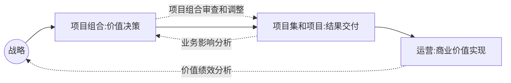

# 1 引论

## 1.1  hello PMP

### 1.1.1 术语

在清辉讲义中，为了方便理解 和遵从习惯。 对于专业术语进行了优化：

- Stakeholder  干系人，指代 相关方。
- Benefit 收益， 指代 效益 毛收入。

### 1.1.2 常见认证类课程

- PMP  项目管理资格认证
- ACP  敏捷项目管理认证
- NPDP 产品精力认证
- 软考  计算机技术与软件专业资格水平考试
- PBA 商业分析师资格认证
- PgMP  项目集管理资格认证

### 1.1.3 学习PMP的收获

- 【传承】思想
- 变革【创新】
- 系统框架(【**5** 大过程组 + **10** 大知识领域】)
- 过程工具(【**49**个项目管理过程 + **132 **个项目管理工具与技术 】)

### 1.1.4 项目管理的学科奠基人

- 费里德里克 - 泰勒 (科学管理奠基人)
- 亨利 - 甘特 (项目管理奠基人，甘特图的发明人)

### 1.1.5 清辉管理的三原则

- 目标管理
  - 目标管理的三个步骤
    - 建立切实可行的目标
    - 目标分解 及 阶段性度量
    - 实施纠错 直至实现目标
  - 制定目标的SMART原则
    - Specific 明确性
    - Measurable 衡量性
    - Attainable 可执行性
    - Relevant 相关性
    - Time-based 时限性
- PDCA
  - PLAN (做计划)
  - DO  （实施）
  - CHECK （检查）
  - ACTION (实现激励机制，总结经验 制定目标)
- 以人为本 (现代企业家应该向这个方向发展)

## 1.2.基本要素

### 1.2.1 项目

#### 定义

项目是为了创造独特的产品 服务 成果 而进行的临时性工作

项目可以创造：
- 一个独特的产品
- 一种独特的服务或提供服务的能力
- 一项独特的成果
- 一个或者多个产品 服务 成果 的独特组合

#### 项目具备的两大特性：

- 独特性 （Unique）
  - 项目创造独特的可交付成果(Deliverable)
  - 项目某些地方重复 不改变项目本身独特性。(比如同样是开发一个网页)
  - 独特性导致不确定性 和风险
  - 独特性使项目需要比常规工作更要精心规划
- 临时性 (Temporary)
  - 有明确的起点和终点
  - 但是时间不一定短
  - 很多项目的结果或者影响具备持久性(金字塔)

####  项目的一个核心思想

- 渐进明细 （随着信息越来越具体，估算越来越准确， 而持续改进和细化项目管理计划.
如 渐进式规划项目）

#### 项目的制约因素

传统的三种制约：(核心点： 质量)
- 范围
- 时间
- 成本

现代的多重制约 （核心点： 干系人/相关人 满意）
- 范围
- 进度
- 预算
- 质量
- 资源
- 风险

####  项目驱动变更

对组织来说，从商业看，项目为了推动组织从一个状态转到另一个状态，从而达成特定目标。
(如： 公司利用一个项目，达成了从初创到上市)

#### 项目创造商业价值

项目的商业价值指特定项目的成果能够为干系人带来的收益

附加说明：

- 对持续运营的有效管理也可以创造商业价值 （如运营 销售）
- 对项目的投资可以提升创造商业价值的能力 （如：软件更新迭代）

####  项目价值的分类 (实现难度从低到高)

- 基础价值 
  - 内部价值 
  - 财务价值 
- 战略价值 
  - 客户相关价值 
  - 未来价值 

#### 项目启动的四大基本场景

- 满足干系人的要求或需求
- 符合法律 法规 或者社会要求
- 创造改进 修复产品或服务
- 执行、变更商业或者技术战略

### 1.2.2 项目管理的重要性

#### 项目管理的定义

项目管理是将知识 技能  工具和技术应用于项目活动，以满足项目的要求。（或者可以说 客户的需求）
#### 如何实现

通过合理利用 整合 49个项目管理过程得以实现。

有效和高效的项目管理应被视为组织的战略能力。它使组织能够：
- 将项目成果与业务目标联系起来
- 更有效地开展市场竞争
- 支持组织发展
- 适当调整项目管理计划，以应对商业环境改变给项目带来的影响

### 1.2.3  项目、项目集、项目组合以及运营管理之间的关系

#### 1.2.3.1 概述

项目集不是大项目。规模特别大的项目称为“大型项目”。一般定 义，大型项目通常需要 10 亿美元或以上的成本，可影响上百万人，并且将持续数年

- 项目集和项目管理的重点在于以“正确”的方式开展项目集和项目
- 项目组合管理则注重于开展“正确”的项目集和项目

#### 1.2.3.2 项目集管理

##### 项目集定义

项目集 是一组相互关联被协调管理的项目 、子项目集 和项目集活动。以便获得分开管理无法获得的利益。

##### 项目集管理重点关注

- 项目间的依赖关系
- 找到管理这些依赖关系的方法， 具体措施包括：
  - 解决项目集内的资源制约/冲突
  - 与对项目集有影响的组织/战略方向保持一致
  - 处理同一个治理结构内相关问题和变更管理

#### 1.2.3.3 项目组合

##### 项目组合定义

项目组合是指为了实现战略目标而组合在一起的项目、项目集、子项目组合 和运营工作。

- 项目组合中的项目不一定有依赖关系或者相关

##### 项目组合管理重点关注

- 通过审查项目、项目集  确定资源分配的优先级 

-  确保对项目组合的管理 和组织战略保持一致 

##### 项目组合相关层级关系举例

- 项目组合 --  举办奥运为
  - 项目集 -  奥运场馆建设
    - 项目 - 羽毛球馆建设
      - 子项目 1 - 主体结构建设
      - 子项目2  --座位建设
      - 子项目3  --给排水建设
      - ..

#### 1.2.3.4 运营管理

略

#### 1.2.3.5 运营与项目管理

##### 运营的定义

运营是支撑日常业务，实现业务战略和战术目标的手段。

如：生产  制造 会计  软件支持 运行维护  等

项目与运营在产品生命周期的不同时点交叉：

- 新产品开发 产品升级 提高产品时
- 改进运营 /产品开发流程时
- 产品生命周期结束阶段
- 在每个收尾阶段

在每个交叉点， 可交付成果及知识在项目和运营之间转移，以完成工作交接。(项目转移到运营 OR 运营转移到项目)

##### 运营的两大特性

持续性、 重复性

#### 1.2.3.6 组织级项目管理(OPM)与战略

##### 组织级项目管理定义

组织级项目管理(OPM)是把项目、项目集和项目组合管理的原则与实践与组织驱动因素
(OE,如：人力 技术 等)联系起来，从而提升组织能力，支持战略目标。

##### 相关的几个小概念 (自顶向下的几个概念)

 - 愿景 （做好自己， 比如：阿里巴巴：做一个百年企业）
 - 使命 （帮助他人， 比如：阿里巴巴：让天下没有难做的生意）
 - 组织战略与目标
 - 项目组合、项目集与项目

##### 组织级项目管理流程图

 

#### 附： 项目管理活动的三个维度

如下图所示：(图中那两个字 是 **沟通**)

### 1.2.4  指南的组成部分

#### 1.2.4.1 项目和开发生命周期

##### 项目生命周期定义

是指项目从启动到收尾的一系列阶段

- 阶段通常按照 **顺序排列**
- 阶段**数量 因项目而异**
- 阶段 **有时间限制**
- **阶段 = 小项目**，有明确起点 和 重点

组成项目生命周期的各个阶段 可以 顺序  迭代 或者交叠进行。

##### 通用的项目生命周期结构( 4阶段 )

- 启动项目 
- 组织和准备 
- 执行项目工作 
- 结束项目

##### 常见的项目生命周期类型

- 预测型(瀑布型) (如：房产开发 桥梁建设)
  - 充分了解交付的产品，有**厚实的行业基础 或者一次性交付对干系人有力**
- 迭代型 （项目范围已经早期确定，时间以及成本估算需要不断修正，如： beta1 beta2   prerelease  release）
  - 通过一系列 **重复的循环活动** 来开发产品
- 增量型  （如： 一周开发一个小模块）
  - 在  **预定的时间**  内渐进地增加产品的功能
- 适应型(敏捷型)
  - 需要应对快速变化的环境，需求范围难以确定
- 混合型 ( 瀑布型 + 敏捷型 )
  - 非常确定的部分按照预测型  ，仍待细化确认的采用 适应型。

##### 如何选择适合自己的生命周期

* 确定需要在各个阶段实时的一个或多个过程
* 在合适的阶段实时确定的一个或多个过程
* 调整各个阶段的属性(名称、持续时间、准入标准、准出标准)

#####  项目生命周期和产品生命周期的关系

项目生命周期 和产品生命周期相互独立，后者可能由项目产生， 产品生命周期指一个产品从概 念、交付、成长、成熟到衰退的整个演变过程的一系列阶段。

#### 1.2.4.2 项目阶段

##### 项目阶段的定义

项目阶段是一组具有逻辑关系的项目活动的集合，通常以一个或多个可交付成果的完成为结束。

## 项目的两种过程

项目的整个生命周期中是通过一系列项目管理活动进行的。

### 项目管理过程 

pmbok主要讲这部分. 一共49个项目管理过程

- 保证项目的顺利开展
- 一共49个项目管理过程， 可以分为五大过程组 
  - 启动
  - 规划
  - 执行
  - 监控
  - 收尾
- 适用于所有项目，具备共性
- pmbok主要探讨 项目管理过程

#### 项目管理过程的定义

旨在创造最终结果的系统化系列活动。 以便对一个或多个输入进行加工，输出一个或多个输出，**简称：过程**

过程由三部分构成:

- 输入
- 工具与技术
- 输出

如：对于 制定项目管理章程 这个过程：

项目管理过程根据开展的时机可以分为三类：

- 仅开展一次或在项目预定义开展的过程
  - 制定项目章程
  - 制定项目管理计划
- 需要定期开展的过程
  - 识别干系人
  - 获取资源
  - 确认范围
- 需要贯穿项目始终执行的过程
  - 监控项目工作
  - 指定进度计划
  - 控制成本

### 产品导向过程(产品实现过程)

因各个领域有差异，pmbok不做主要探讨

### 项目管理过程组 和项目生命周期的区别

