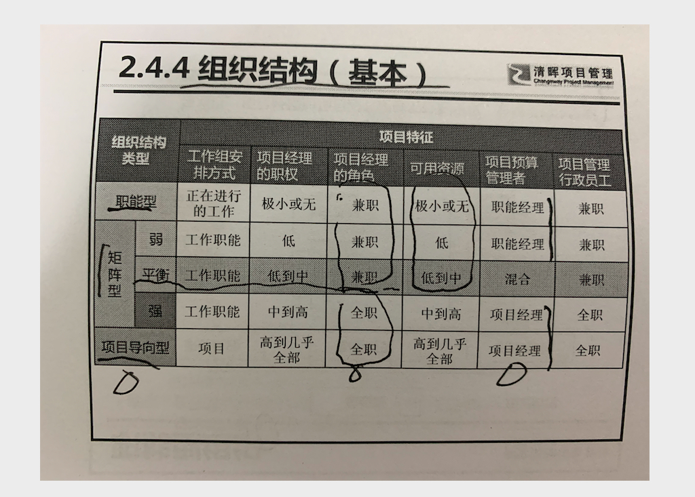

# 2 项目运行环境

## 2.1 概述

组织所处的环境可能对项目产生有利或不利的影响。 这些影响的两大主要来源:

- **项目事业因素(EEFs)**
  - 外部
  - 内部
- **组织过程资产(OPAs)**
  - 过程 、政策和程序
  - 组件知识库

除了这两部分，**组织系统**对项目生命周期也有很大的作用。

## 2.2 事业环境因素(EFFs)

### 定义

事业环境因素是项目团队不能控制的，将对项目产生影响 限制 或指令作用的各种条件。

EFFs是许多项目管理过程的输入， 项目管理过程通常不能反向影响事业环境因素。例外: 资源管理过程

### 2.2.1 组织内部的事业环境因素

- 组织文化、结构和治理
  - 如： 愿景 使命 领导风格 等级制度 职权关系 组织风格  道德和行为规范等。

- 设施资源的地理分布
  - 工厂位置  虚拟团队  共享系统如云计算等
- 基础设施
  - 现有设施 设备  组织通讯渠道 IT硬件 等
- 信息技术软件
  - 如：进度管理工具  配置管理系统  其他自动化系统的网络接口 工作授权系统等。
- 资源可用性
  - 如：合同和采购制约因素    **已批准的供应商**   分包商和合作协议 等
- 员工能力
  - 如：现有员工的专业技能 能力 和特定知识 等 

### 2.2.2 组织外部的事业环境因素

- 市场条件 （如：竞争对手 份额 商标 品牌认知度 等）
- 社会和文化影响  （政治氛围   行为规范 道德和观念 等）
- 法律限制 （例如包括与安全、数据保护、商业行为、雇佣和采购有关的国家或地方    **法律法规**）
- 商业数据库 （如：包括标杆对照成果、标准化的成本估算数据 ； 行业风险研究资料和风险 数据库。）
- 学术研究 ( 包括 行业研究、出版物和标杆对照成果等)
- 政府或行业标准 （包括与 产品、生产、环境、质量和工艺有关的**监管机构条例和标准**）
- 财务考虑因素 （汇率 地理位置等）
- 物理环境因素 （天气  、工作环境）

## 2.3 组织过程资产(OPAs)

组织过程资产是**执行组织所特有并使用的 计划  、过程、 程序、 政策 和知识库**   ，会影响对具体项目的管理。

可分为两大类：

- 过程 政策 程序(通常**由PMO或项目以外的其他部门来更新**)
- 组织知识库 （通常**由项目更新**，是在整个项目期间结合项目信息而更新的）
  - 配置管理知识库
  - 财务数据库
  - 历史信息经验教训知识库
  - 问题和缺陷管理知识库
  - 测量指标数据库
  - 以往项目的项目档案

小技巧： 一般说某某程序 ，通常是组织过程资产， 某某系统一般是事业环境因素

## 2.4 组织系统

### 2.4.1 概述

为了高效的开展项目，项目经理需要了解组织内的职责 、终责和职权的分配情况，这样有助于项目经理有效的利用其权利、影响力、能力、领导力和政治能力成功完成项目

单个组织内各种因素交互影响，创造出一个独特的系统，会对在其中运行的项目造成影响。这种组织系统决定了内部成员的 权利、影响力、利益、能力和政治能力。

系统因素包括但不限于：

- 管理要素
- 治理框架
- 组织结构模型

本概述先简要介绍一下系统。

系统是各种组件的集合，可以实现单个组件无法实现的成果。组件 是项目或组织内的可识别要素，提供了某种特定功能或一组相关的功能。各种系统组件的相互作用 创造出组织文化和能力。

- 系统是动态的。
- 系统是可以优化
- 系统组件可以 优化
- 系统和组件不能同时优化
- 系统呈现非线性响应。 （输入的变更不会产生可预测的输出）

系统通常由组织管理员负责，组织管理层 检查组件与系统之间的优化权衡，以便采取合适的措施 为组织实现最佳结果。这一检查工作的结果将对相应的项目造成影响。 项目经理在确定如何 达成项目目标时务必要考虑这些结果。此外，项目经理应考虑到组织的治理框架。

### 2.4.2 组织治理框架

治理是针对管理的管理， 治理指组织各个层面的有组织的或有结构的安排，旨在确定和影响组织成员

的行为 。

#### 2.4.2.1 治理框架

治理框架会影响：

- 组织目标的设定和实现方式
- 风险监控和评估方式
- 绩效优化方式

#### 2.4.2.2 项目组合、项目集和项目治理

协调组织级项目管理 (OPM) 与项目组合、 项目集和项目管理的常见治理框架，涉及四个治理领域 :
- 一致性、风险、绩效和沟通。（各个领域都 具备以下职能部门: 监督、控制、整合与决策）

项目治理是指用于指导项目管理活动的框架、功能和过程，从而创造独特的产品、服务或结果以 满足组织、战略和运营目标

### 2.4.3 管理要素

关键职能部门或一般管理原则包括(但不限于)：

- 基于专业技能和可用性开展工作的部门
- **组织授予的工作职权**
- 工作职责，开展组织根据技能和经验等属性合理分派的工作任务
- 具有纪律性的行为
- **统一指挥原则**
- **统一领导原则**
- 组织的总体目标优先于个人目标
- 支付合理的薪酬
- 资源的优化使用
- 畅通的沟通渠道
- 公正、平等地对待所有员工
- 明确工作岗位的安全职责
- **确保员工安全**
- **允许任何员工参与计划和实施**
- 保持员工士气

### 2.4.4 组织结构类型

#### 2.4.4.1 组织结构的类型

平衡矩阵型是PMP学习及考试中的缺省结构

在弱矩阵型组织中，项目经理担任联络员(地位低) 或者协调员(地位高)

**职能型 和 矩阵型，由职能经理管理资源。**

平衡矩阵型组织典型特点：

- 优点
  - 项目经理(PM)负责制，项目目标明确
  - 职能部门成员参与项目，充分利用人力资源。
  - PM和FM共同促进项目优化
  - 有利于跨部门沟通
  - 项目完成后 有家可归
- 缺点
  - 项目经理权利不足
  - 项目容易有两个老板，项目工作和职能工作容易冲突。
  - 决策周期长
  - 结构负责 管理难度大，需要良好的系统支持
  - 有退路，项目团队认同感不高。

#### 2.4.4.2 组织结构选择的考虑因素

略

#### 2.4.4.3 项目管理办公室

##### 定义

是对项目相关的治理过程进行标准化，并促进资源、方法论、工具和技术共享的一个组织部门。

- PMO可以根据组织所需设置在组织不通层级
- PMO职责范围可大可小，从提供项目管理支持服务到管理一个多多个项目

##### 三种类型

- 支持型 --- 担任顾问，对项目提供模板 最佳实践 培训 经验教训等资源支持
- 控制型 --- 不仅提供支持，而且通过各种手段要求项目服从
  - 项目管理框架和方法论
  - 使用特定的模板、表格和工具
  - 服从治理

- 指令型
  - 直接管理 控制项目
  - 项目经理由PMO指定并直接向其报告。

PMO 的具体形式、职能和结构 取决于所在组织的需要。

##### PMO的两大作用（具体能否能够行使，得看PMO的职能 ）

- 决策
  - 提出建议
  - 领导知识传递
  - 终止项目
  - 根据需要采取其他行动
- 支持项目经理
  - 略

