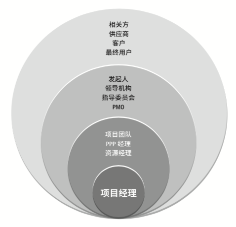

# 3 项目经理的角色

## 3.1 概述

项目经理的角色更像 乐队的指挥。

作为领导和管理项目的责任人，项目经理在团队中的职责 首先是 整体的角度来看待团队产品，以便进行规划、协调和完成。首先，应审 查各自组织的愿景、使命和目标，确保与产品保持一致。然后解释与成功完成产品相关的愿 景、使命和目标。最后向团队沟通自己的想法，激励团队成功完成目标。

项目经理无需承担项目中的每个角色，但应具备项目管理知识、技术知识、理解和经验。 项目经理通过沟通领导项目团队进行规划和协调。项目经理采用书面沟通(文档计划和 进度)，还通过会议和口头提示或非言语提示与团队进行实时沟通

### 3.2 项目经理的定义

- 职能经理专注于对某个职能领域或业务 部门的管理监督
- 运营经理负责保证业务运营的高效性
- 项目经理是由执行组织委派，领导团队实 现项目目标的个人

### 3.3 项目经理的影响力范围

#### 3.3.1 概述

影响力范围示例：

- 项目团队 PPP经理 资源经理
- 发起人 领导机构  指导委员会   PMO
- 相关方 供应商  客户  最终用户

#### 3.3.2 项目经理对项目的影响

- 领导团队，实现项目目标和干系人期望
- 利用可用资源， 平衡相互竞争的制约因素
- 充当发起人 、 团队成员  和其他干系人之间的沟通桥梁。
- 使用软技能 来平衡项目干系人之间的相互冲突和竞争的目标，以达成共识
- 2%最优秀的项目经理，脱颖而出的原因是超凡的人际关系 和 沟通技能 以及积极的态度。

关于沟通能力，主要体现在如下方面：

- 通过多种方法(口头 书面和非书面) 培养完善的技能。
- 重建维护 遵循沟通计划和进度计划
- 不断的以可预见的方式沟通
- 寻求了解项目相关方的沟通需求
- 以简练 清洗 完整 简单  相关 和经过裁剪的方式进行沟通
- 包含重要的正面和负面消息
- 包含反馈渠道
- 人机关系技能。(过项目经理的影响力范围拓展广泛的人际网络)

### 3.3.3 项目经理对组织的影响

- 项目经理需要积极和其他项目经理互动，其他项目 或者 项目集内的项目可能对项目造成影响 原因：
  - 对相同资源的需求
  - 资金分配的优先顺序
  - 可交付成果的接收或发布
  - 项目和组织的目的、目标的一致性
- 项目经理扮演强有力的倡导者角色
- 项目经理致力于提高自己在整个组织内的项目管理能力和技能，并参与隐形和显性知识的转化或整合计划
- 项目经理还应致力于：
  - 展现项目管理的价值
  - 提高组织对项目管理的接受度
  - 提高现有PMO的效率

### 3.3.4 项目经理对行业的影响

项目经理应该时刻关注行业最新趋势，并思考对项目是否可用， 如：

- 新的标准
- 技术支持工具
- 等

### 3.3.4 项目经理对专业学科的影响

向其他人士分享知识和专业技能

### 3.3.6 项目经理对跨领域的影响

项目经理可以出任非正式的宣传大使，让组织了解项目的及时性 质量 创新 资源管理方面的优势。

## 3.4 项目经理的能力

#### 3.4.1 概述

项目经理核心技能, (PMI人才三角)：

- 技术项目管理 
- 领导力 （指导、激励和带领团队所需的知识、技能和行为，可帮助组织达成业务目标）
- 战略与商业管理   关于行业和组织的知识和专业技能，有助于提高绩效并取得更好的业务成果。

