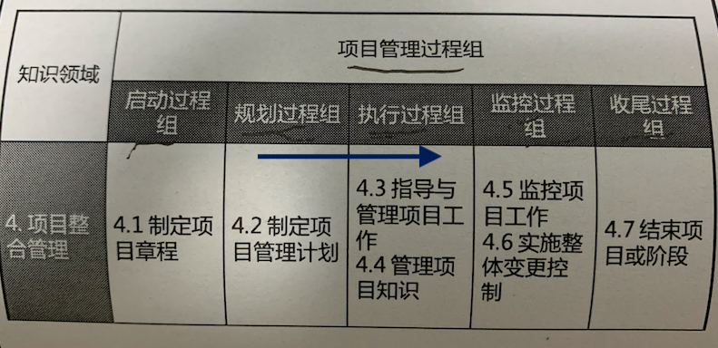
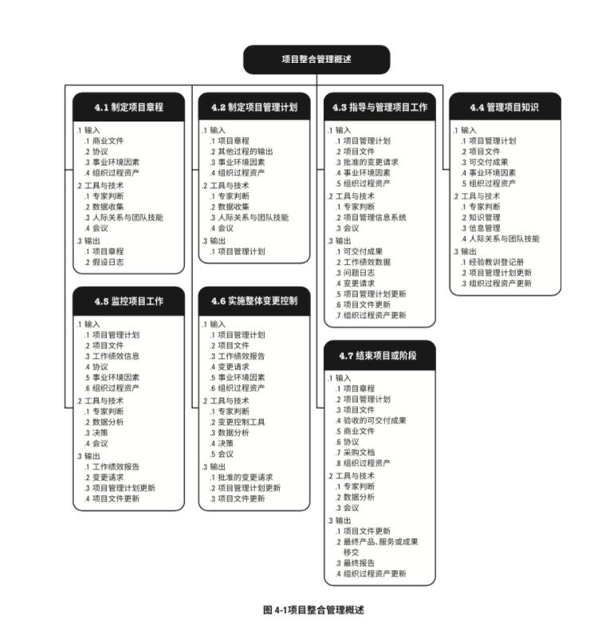

# 4 项目整合管理

在项目管理中， 整合  兼具有统一 、合并、沟通和建立联系的性质，**这些行动应贯穿项目始终** 

**整合是一个知识领域**

项目整合管理包括进行以下选择：

- 资源**分配**
- **平衡**竞争性需求
- 研究各种备用方法
- 为实现项目目标而裁剪过程
- 管理各个项目管理知识领域之间的依赖关系

项目整合管理的核心概念：

项目整合管理必须由项目经理负责，其他知识领域可以有相关领域专家管理，但是整合的责任不能被授权或转移。

项目和项目管理本质上具有整合性质。

项目管理的各个过程组之间经常发生联系。

整合知识领域的构成：

- 4.1 制定项目章程   ---  属于启动过程组
- 4.2 制定项目管理计划  -- 属于规划过程组
- 4.3 指导和管理项目工作 && 4.4 管理项目知识 - 属于执行过程组
- 4.5 监控项目工作 && 4.6 实施整体变更控制 -  属于监控过程组
- 4.7 结束项目或阶段  - 属于收尾过程组

项目整合管理的整体概览：

项目整合管理的发展趋势及新型实践：

- 使用自动化工具。 （如： PMIS 项目管理信息系统）
- 使用可视化管理工具
- 项目知识管理
- 增加项目经理的职责
- 混合型方法 经实践检验的新做法会不断地融入项目管理方法，例如，采用敏捷或其他迭代做 法，为开展需求管理而采用商业分析技术，等。

因为每个项目都是独特的，所以项目经理可能需要裁剪项目整合管理过程。裁剪时应考虑的因素 包括(但不限于)：

- **项目生命周期**  什么是合适的项目生命周期?  项目生命周期应包括哪些阶段?
- **开发生命周期**   什么是合适的开发生命周期和开发方法?预测 型或适应型方法是否适当?
- **管理方法**  考虑到组织文化和项目的复杂性，哪种管理过程最有效?
- **知识管理**  在项目中如何管理知识以营造合作的工作氛围?
- **变更**  在项目中如何管理变更
- **治理**   哪些监控机构、委员会和其他相关方该参与项目治理?对项目状态报告的要求是什么?
- **经验教训**  在项目期间及项目结束时，应收集哪些信息?历史信息和经验教训是否适用于未来 的项目?
- **收益**  应该在何时以何方式报告效益:

在敏捷或者适应型项目环境中需要考虑的因素：

敏捷或者适应型方法能够促进团队成员以相关领域专家的身份参与整合管理。

项目经理的关注点在于营造一个合作型的决策氛围，并确保团 队有能力应对变更。如果团队成员具有广泛的技能，这种方法会更加有效。

## 4.1 制定项目章程

过程定义：

编写一份**正式批准项目并授权项目经理在项目活动中使用组织资源**的过程。 

过程作用：

明确项目与组织战略目标之间的直接联系，确保项目的正式地位，并展示组织对项目的承诺。

相关知识点：

- 没有章程不开始项目。项目章程的批准 标志着项目的正式启动。

- 本过程仅仅开展一次(项目)，或者仅在项目的预定义点开展(项目中的各个阶段)。

- 项目经理的正式任命时间：
  - 尽早确认并任命项目经理
  - 最好在制定项目章程时任命
  - 最迟在规划开始前任命

- 项目经理应该参与项目章程的指定，以便对项目需求有个基本的了解，并能更有效的分配资源
- 项目由项目以外的机构启动，如： 发起人、  项目集 、 PMO、   项目组合治理会员会主席/授权代表 等
- 项目启动者/发起人 应该具备一定的职权，能为项目获取资金并提供资源
- 通过编制项目章程， 确认项目符合组织战略和日常运营的需要。
- 合同不可取代章程
- 

