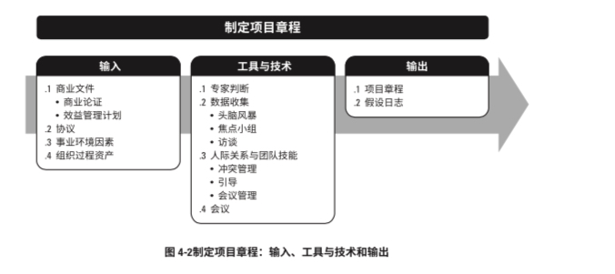
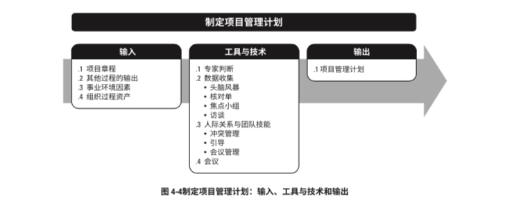
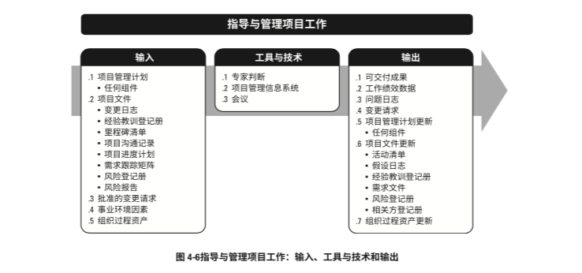
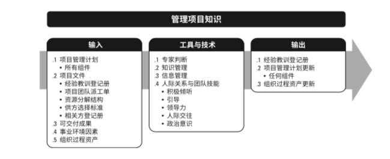
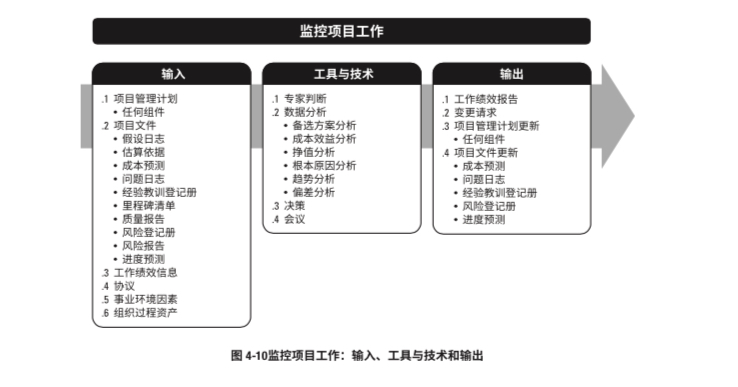
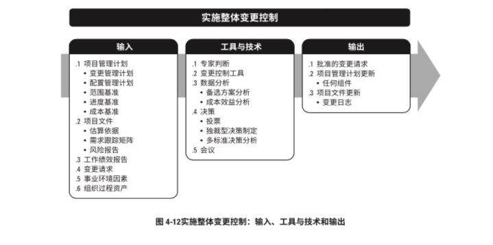
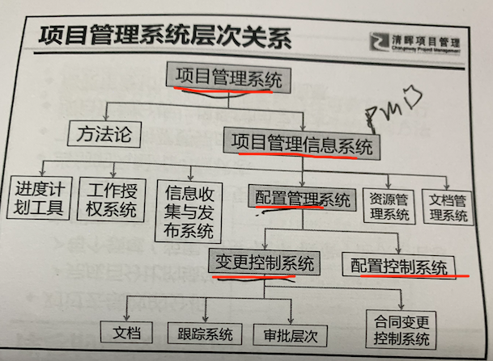
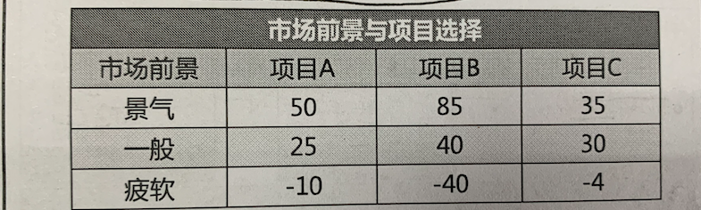

# 4 项目整合管理

在项目管理中， 整合  兼具有统一 、合并、沟通和建立联系的性质，**这些行动应贯穿项目始终** 

**整合是一个知识领域**

项目整合管理包括进行以下选择：

- 资源**分配**
- **平衡**竞争性需求
- 研究各种备用方法
- 为实现项目目标而裁剪过程
- 管理各个项目管理知识领域之间的依赖关系

项目整合管理的核心概念：

项目整合管理必须由项目经理负责，其他知识领域可以有相关领域专家管理，但是整合的责任不能被授权或转移。

项目和项目管理本质上具有整合性质。

项目管理的各个过程组之间经常发生联系。

整合知识领域的构成：

- 4.1 制定项目章程   ---  属于启动过程组
- 4.2 制定项目管理计划  -- 属于规划过程组
- 4.3 指导和管理项目工作 && 4.4 管理项目知识 - 属于执行过程组
- 4.5 监控项目工作 && 4.6 实施整体变更控制 -  属于监控过程组
- 4.7 结束项目或阶段  - 属于收尾过程组

项目整合管理的整体概览：

项目整合管理的发展趋势及新型实践：

- 使用自动化工具。 （如： PMIS 项目管理信息系统）
- 使用可视化管理工具
- 项目知识管理
- 增加项目经理的职责
- 混合型方法 经实践检验的新做法会不断地融入项目管理方法，例如，采用敏捷或其他迭代做 法，为开展需求管理而采用商业分析技术，等。

因为每个项目都是独特的，所以项目经理可能需要裁剪项目整合管理过程。裁剪时应考虑的因素 包括(但不限于)：

- **项目生命周期**  什么是合适的项目生命周期?  项目生命周期应包括哪些阶段?
- **开发生命周期**   什么是合适的开发生命周期和开发方法?预测 型或适应型方法是否适当?
- **管理方法**  考虑到组织文化和项目的复杂性，哪种管理过程最有效?
- **知识管理**  在项目中如何管理知识以营造合作的工作氛围?
- **变更**  在项目中如何管理变更
- **治理**   哪些监控机构、委员会和其他相关方该参与项目治理?对项目状态报告的要求是什么?
- **经验教训**  在项目期间及项目结束时，应收集哪些信息?历史信息和经验教训是否适用于未来 的项目?
- **收益**  应该在何时以何方式报告效益:

在敏捷或者适应型项目环境中需要考虑的因素：

敏捷或者适应型方法能够促进团队成员以相关领域专家的身份参与整合管理。

项目经理的关注点在于营造一个合作型的决策氛围，并确保团 队有能力应对变更。如果团队成员具有广泛的技能，这种方法会更加有效。

## 4.1 制定项目章程

过程定义：

编写一份**正式批准项目并授权项目经理在项目活动中使用组织资源**的过程。 

过程作用：

明确项目与组织战略目标之间的直接联系，确保项目的正式地位，并展示组织对项目的承诺。

相关知识点：

- 没有章程不开始项目。项目章程的批准 标志着项目的正式启动。

- 本过程仅仅开展一次(项目)，或者仅在项目的预定义点开展(项目中的各个阶段)。

- 项目经理的正式任命时间：
  - 尽早确认并任命项目经理
  - 最好在制定项目章程时任命
  - 最迟在规划开始前任命

- 项目经理应该参与项目章程的指定，以便对项目需求有个基本的了解，并能更有效的分配资源

- 项目由项目以外的机构启动，如： 发起人、  项目集 、 PMO、   项目组合治理会员会主席/授权代表 等

- 项目启动者/发起人 应该具备一定的职权，能为项目获取资金并提供资源

- 通过编制项目章程， 确认项目符合组织战略和日常运营的需要。

- 合同不可取代章程

  

### 4.1.1 输入

#### 4.1.1.1 商业文件

商业文件包括 ：
- **商业论证**  商业论证从商 业视角描述必要的信息，并且据此决定项目的期望结果是否值得所需投资。高于项目级别的经 理和高管们通常使用该文件作为决策的依据，一般情况下商业论证包括：
  - 商业需求
  - 成本效益分析
- **收益(效益)管理计划**

一般情况下商业论证的编制可能由如下原因 引发：

- 市场需求，如：为应对汽油短缺，某汽车厂商批准一个低油耗车型研发仰慕
- 组织需要， 如：因管理费用太高，公司决定合并一些职能并优化流程以降低成本
- 客户要求 ，如： 为给新工业园区供电， 某供电公司批准一个新建变电站项目
- 技术进步。 如： 基于技术进步某公司批准新项目- 开发电子机票取代纸质机票
- 法律要求   如：某油漆制品厂批准一个项目，来编写有害物质处理指南。
- 生态要求  如：某公司批准一个项目 ，来降低对环境的影响
- 社会需要 。  例如：某非盈利组织 为社区建立饮用水系统和公共厕所 并开展卫生教育

项目经理不可以对商业文件进行更新或修改， 只能提出相关建议

#### 4.1.1.2 协议

协议用于定义启动项目的初衷

协议具有多种形式：

- 合同 （为外部客户做项目，一般采用合同的形式）

- 谅解备忘录

- 服务水平协议SLA

- 协议书

- 意向书

- 口头协议

- 电子邮件

- 其他书面协议

#### 4.1.1.3 事业环境因素

略

#### 4.1.1.4 组织过程资产

略

### 4.1.2  工具与技术

#### 4.1.2.1 专家判断

是指基于某领域 学科知识行业的专业知识做出的，关于当前活动的合理判断

具有专业学历 知识 技能的任何小组或个人都可以提供专家判断，尤其是主题专家

4.1.2.2  数据收集

本过程的数据收集技术，包括但不限于：

- **头脑风暴**。 用于短时间获取大量创意，适用于团队环境，需要引导者引导，有两部分构成

  - 创意产生
  - 创意分析

- **焦点小组** 召集干系人 主题专家 来讨论项目风险、 成功标准或者其他议题

- **访谈** ，指 通过和干系人直接交谈，来获取信息的 正式或非正式的方法。通常一对一，有时也可以多对多。有助于识别和定义所需产品可交付成功的特征或功能。 也可以用于获取机密信息。

  

#### 4.1.2.3 人际关系与团队技能

可用于本过程的人际关系与团队技能包括：

- **冲突管理** ，有助于干系人就目标 成功标准 高层级要求  项目描述 总体里程碑 和其他内容打成一致意见
- **引导** ，是指有效指导团队活动以达到成功决策、解决方案或者结论的能力。引导者确保参与者有效参与，互相理解，考虑所有意见，按既定决策流程全力支持得到的结论或结果，以及所 达成的行动计划和协议在之后得到合理执行
- **会议管理** ，包括准备议程 确保邀请每个关键干系人群体的代表，以及准备和发送后续的会议纪要和行动计划。

#### 4.1.2.4 会议

略

### 4.1.3 输出

#### 4.1.3.1 项目章程

- 项目启动者或者发起人公布的，正式批准项目成立，并授权项目经理动用组织资源开展项目活动的文件
- 章程相当于项目发起人和项目经理之间的契约，项目经理接受章程，就相当于接受了发起人的委托

#### 4.1.3.2 假设日志

假设日志用于记录整个项目声明周期中所有的假设条件(风险)和制约因素

- 假设条件(是渐进明细的，是风险识别的一项重要输入  是有时间限制性的)
- 制约因素  对项目或过程的执行有影响的限制性因素。如：组织事先确定的预算、强制性日期  进度里程碑 合同条款等。  （通常不可变   不是渐进明细的）

## 4.2 制定项目管理计划

过程定义：

定义、准备和协调项目计划的所有组成部分，并把他们整合成一份综合项目管理计划的过程。

过程作用：

生成一份综合文件，用于确定所有项目工作的基础 及其执行方式。

仅仅开展一次(项目) 或者 在项目的预定义点(阶段)开展

项目管理计划确定项目 执行  监控 收尾的方式， 它应该足够健壮和敏捷， 以应对不断变化的项目环境。

项目管理计划应该基准化，确定基准之前，更新无需遵循正式流程，一旦基准华之后，只能通过实施变更控制过程进行更新，这种更新导致在项目收尾之前， 项目管理计划不断渐进明细。

隶属于项目集或者项目组合的项目管理计划需要和项目集或项目组合管理计划相一致。

### 4.2.1  输入

#### 4.2.1.1 项目章程

#### 4.2.1.2 其他过程的输出

#### 4.2.1.3 事业环境因素

#### 4.2.1.4 组织过程资产

- 项目管理计划模板
- 变更控制程序
- 历史经验教训知识库

### 4.2.2   工具和技术

#### 4.2.2.1 专家判断

#### 4.2.2.2 数据收集

- 头脑风暴
- **核对单** 是包括需要考虑的项目、行动或要点的清单， **常用来作为提醒**
- 焦点小组
- 访谈

#### 4.2.2.3 人际关系和团队技能

- 冲突管理
- 引导
- 会议管理

#### 4.2.2.4 会议

### 4.2.3  输出

#### 4.2.3.1 项目管理计划

项目管理计划是说明项目将如何执行、监控、收尾的一份文件，包括但不限于如下：

- 子管理计划 (需求 +   范围 进度 成本 质量 资源 沟通 风险 采购 相关方 -- 管理计划)

- 基准 (范围基准  进度基准  成本基准)
- 其他
  - 变更管理计划 -- 描述 如何 正式审批和采纳变更请求
  - 配置管理计划  -- 描述如何记录和更新项目的特定信息 以及应该记录和更新那些信息 以保证产品 服务 或成果的一致性 && 有效性。
  - 绩效测量基准PMB
  - 项目生命周期，描述项目从开始到结束的一些列阶段。
  - 开发方法     描述开发方法，如： 预测  迭代  敏捷 或混合型。
  - 管理审查  ，描述 审查项目的时间点 以及考了绩效是否符合预期 或者确定是否有必要采取预防和纠正措施。

项目管理计划是用于管理项目的主要文件之一，管理项目时还会使用其他项目文件。这些其他文 件不属于项目管理计划，但它们也是实现高效管理所必需的文件

## 4.3 指导和管理项目工作

定义：

是为实现项目目标而领导和执行项目管理计划中所确定的工作，并实施已批 准变更的过程

过程作用：

对项目工作和可交付成果开展综合管理，以提高项目成功的 可能性

本过程产生可交付成果

本过程收集工作绩效数据，以传递给控制过程进行分析。

### 4.3.1 输入

项目管理计划(中的任何组件)

- 项目管理计划

- 项目文件 （典型的如下：）
  - 变更日志
  - 经验教训登记册
  - 里程碑清单等

- 批准的变更请求

- 事业环境因素

- 组织过程资产

### 4.3.2 工具与技术

- 专家判断
- 项目管理信息系统 PMIS （解决了大量信息的管理问题）
  - 可提供信息技术软件工具
  - 自动收集和报告KPI是PMIS的重要功能
- 会议
  - 开工会议
  - 每日站会
  - 回顾会议等

### 4.3.3  输出

- **可交付成果**
- **工作绩效数据**
  - 已完成的工作
  - KPI
  - 技术绩效策略结果
  - 可交付成果的数量
  - 变更请求数量
  - 缺陷数量
  - 实际发生的成本
  - 实际持续时间等

- **问题日志**(Issue log)
  - 可以帮助项目经理有效跟进和管理问题，确保他们得到调查和解决
- **变更请求**
  - 预防措施 --如： 预防绩效偏差
  - 纠正措施  - 如： 纠正绩效偏差
  - 缺陷补救  - 如： 修正缺陷的产品或组件
  - 更新  - 针对受控文件或计划的变更
- **项目管理计划更新** (项目管理计划的任何变更都通过变更请求的形式提出，且任一组成部分都可在本过程中通过变更请求加以更新)
- 项目文件更新
- 组织过程资产更新

## 4.4 管理项目知识

过程定义：

使用现有知识 生成新知识，以实现项目目标，并且帮助组织学习的过程

过程作用：

利用已有的组织知识来创造或改进项目成果，并且使当前项目创造的知识能够支持组织运营和未来的项目或阶段。

本过程在项目项目期间开展。

知识通常分为“显性知识”(易使用文字、图片和数字进行编撰的知识)和“隐性知识”(个体 知识以及难以明确表达的知识，如信念、洞察力、经验和“诀窍”)两种

知识管理最重要的环境是营造一种互相信任的氛围，激励人们分享知识并关注其他人的知识。

### 4.4.1 输入

- 项目管理计划
- 项目文件
  - 经验教训登记册
  - 项目团队派工单
  - 资源分配结构
  - 供方选择标准
  - 相关方登记册
- 可交付成果
- 事业环境因素
- 组织过程资产

### 4.4.2 工具和技术

- 专家判断

- 知识管理 信息管理工具和技术用于创建人们与知识之间的联系，可以有效促进简单、明确的显性知识的

  分享

- 信息管理

- 人际关系和团队技能

  - 积极聆听
  - 引导
  - 领导力
  - 人际交往
  - 政治意识

### 4.4.3  输出

- 经验教训登记册
- 项目管理计划更新
- 组织过程资产更新

## 4.5 监控项目工作

过程定义：

跟踪、审查和报告整体项目进展，以实现项目管理计划中确定的绩效目标的过程。

过程作用：

让干系人了解项目的当前状态并认可处理绩效问题而采取的行动。

监督贯穿整个项目。控制包括 制定纠正 和预防措施 或重新规划。

### 4.5.1 输入

- 项目管理计划
- 项目文件
- 工作绩效信息
- 协议
- 事业环境因素
- 组织过程资产

### 4.5.2 工具和技术

- 专家判断
- 数据分析
  - 备选方案分析
  - 成本效益分析
  - 挣值分析
  - 根本原因分析
  - 趋势分析
  - 偏差分析
- 决策
- 会议

### 4.5.3 输出

- 工作绩效报告
- 变更请求
- 项目管理计划更新
- 项目文件更新

工作绩效报告是 为制定决策 采取行动而汇编工作绩效数据形成的实物或电子文档。

根据项目沟通管理计划，通过沟通过程向项目干系人发送工作绩效报告。

可以为 仪表板(dash board) 热点报告heat report 信号灯图stop light chart 等

##### 

通过比较实际情况和计划，可能需要提出变更请求，以调整质量要求或者范围 进度 成本基准。

变更可能包括：  纠正措施    预防措施  缺陷补救

## 4.6 实施整体变更控制

定义： 审查所有变更请求 ，批准(同意 or 拒绝)变更， 管理对可交付成果 项目文件 和项目管理计划的变更。 并对变更处理结果进行沟通的过程

实施整体变更控制贯穿项目始终， 项目经理对此承担最终责任。

任何干系人都可以提出变更请求， 尽管可以口头提出变更请求 但所有变更请求都必须以书面形式记录，并纳入变更管理 和  配置管理系统中。

变更请求应该由变更控制系统 和配置管理系统中规定的过程处理。

变更控制委员会CCB，是正式的团体，但不一定是固定的团体。 设立原因： 项目经理权力有限，对于涉及计划基准的变更不能自作主张。 CCB的决策方式： 通常采用一致同意的原则。

变更批准的权限：

- 项目经理
  - 批准不涉及基准的变更请求
  - 紧急情况可批准特殊的变更请求（应急计划  权变措施等）
- CCB
  - 批准或否确设计基准的变更请求
- 发起人
  - 批准设计项目章程的变更
- 客户
  - 批准按合同实施的某些变更请求

多标准决策分析： 借助决策矩阵 用系统分析方法建立 风险水平 不确定性 和价值收益等多种标准，从而对多种方案进行评估的一种技术。 典型应用： 不确定性下的决策准则。

## 4.7 结束项目或阶段

