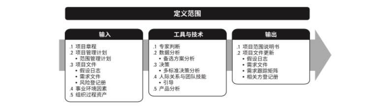

# 5 项目范围管理

理解绩效

公司的绩效：  财务 客户  内部经营管理 员工学习成长 。

项目的绩效：  范围  进度 成本。(这三部分综合反映了项目的质量)

平衡记分卡(BSC) 是 对于公司绩效常用的考核方式之一。从财务 客户 内部经营管理  员工学习正常角度进行衡量的新型绩效管理体系。

范围管理的目的： 做且只做所需的全部工作，以成功完成项目。

范围的区分：

- 产品范围 - **某项  ** **产品、服务或成果所具有的的特性和功能**。
  - 衡量依据： 需求文件
- 项目范围 - **为交付**具有规定特性或功能的**服务或成果 而必须完成的工作**。
  - 衡量依据： 项目管理计划

项目范围 有时也包括产品范围。

范围基准由 范围说明书 、   WBS 、  WBS词典三部分构成。

趋势、裁剪  和敏捷考虑：

- 趋势
  - PM和BA的角色应当分开。 
  - PM和BA紧密合作，以便确定问题 并识别商业需要
- 裁剪
- 敏捷考虑
  - 项目开始时，通常无法确定项目的范围，需要渐进明细确认。
  - 敏捷方法在项目早起特意缩短定义和协商范围的时间
  - 敏捷方法把需求列入Backlog，通过多次发布版本明确需求。（Backlog -> PBI（产品代办项）-> SBI(冲刺迭代项)）

## 5.1 规划范围管理

过程定义：  创建范围管理计划，书面描述如何定义 确认 控制项目范围的过程。

过程作用：  对如何管理范围提供指南和方向。

- 项目范围管理计划 是项目管理计划的组成部分， 描述如何定义、指定、监督、控制和确认项目范围。
- 范围管理是项目管理的基础

### 5.1.1 输入

见上图

#### 5.1.2 工具和技术

见上图

#### 5.1.3 输出

#### 5.1.3.1 范围管理计划

定义 描述如何定义、制定、监督、控制和确认项目范围。

范围管理计划对如下过程做出规定：

- 制定项目范围说明书
- 根据详细项目范围说明书创建WBS
- 如何审批和维护范围基准
- 正式验收可交付成果
- 处理项目范围说明书的变更

根据项目需要，范围管理计划可以是正式或非正式，非常详细或者概括的。

#### 5.1.3.2 需求管理计划

其是项目管理子计划之一。

描述将如何分析、记录和管理项目和产品需求

主要内容：

- 如何规划、跟踪和报告各种需求活动
- 配置管理活动
- 需求优先级排序活动
- 测量指标及使用指标的路由
- 反映那些需求属性将被列入需求跟踪矩阵。

## 5.2 收集需求

定义： 为了实现目标而确定、记录、管理干系人需求 和 需求的过程。

包括：

- 客户/发起人/干系人 已量化且书面记录的需要 和期望。

### 5.2.1 输入

见上图

### 5.2.2 工具和技术

**问卷调查** 适用场景：

- 受众多
- 需快速完成调查
- 受访者地理位置分散
- 适合使用统计分析

**标杆对照**：

将**实际**或计划的产品 、过程 和实践 **与其他**可比组织的实践**进行比较**，以便**识别最佳**实践。

**文件分析**：

通过**分析现有文**档，识别和需求相关的信息， 来挖**掘需求**。

**决策**：

- 投票
  - 一致同意， 100%同意。
    - 常规方式
    - 德尔菲技术(为了防止个人对结果产出不恰当影响)
      - 专家之间背靠背
      - 专家以匿名形式提出意见
      - 多轮次
      - 旨在取得一致意见。
  - 大多数同意。 超过50%同意， 一般用在两个选项时候使用。
  - 相对多数同意， 候选项超过2个时候使用。

- 独裁型决策
- 多标准决策分析

**亲和图**：

对大量创意进行分组，一遍进一步审查分析。又称KJ法。，利用了归纳法。

**思维导图**：

把从头脑风暴中获得的创意整合为一张图，反应创意的共性和差异，激发新创意。 利用了演绎法。

**名义小组技术**：

是一种促进头脑风暴的技术。通过投票获得最有用的创意，一遍进一步进行头脑风暴或者优先排序。

- 每个人独立思考
- 每个人陈述自己的意见
- 全部人员对意见进行投票
- 人数最多的方案就是所要的方案。

**观察/交谈**：

主要是针对产品使用者难以或者不愿清晰说明他们的需求

- 工作跟随 (从外部观察业务专家如何执行工作)
- 参与观察者 （实际执行一个流程或程序，体验该流程或程序如何实施，以便挖掘隐藏的需求）

**引导**：

通常和主题研讨会结合使用，召集主要干系人一起讨论需求。可用于快速定义跨职能需求和协调干系人的需求差异。

适合采用引导的情景包括：

- 联合应用设计或开发(JAD)
- 之类功能展开 QFD
- 用户故事- 用户故事是对所需功能的简单文字描述。产生于需求研讨会。
  - 角色
  - 目标
  - 动机

**系统交互图**：

对产品范围的可视化描绘，反应系统和人/其他系统之间的交互方式。

**原型法**：

在实际制造产之前， 先早出产品的实用模型，并根据此征求对需求的早期反馈意见。(微缩产品、2D 3D模型 实体模型  模拟等)

原型法符合渐进明细的理念，过程中需要重复如下过程：

原型制作 --- 用户体验 --- 反馈收集 ---  原型修改

大量重复后，就可以获得足够完整的需求。故事板是一种广泛应用的原型技术。通过一系列的图像来展示顺序或导航路径。

### 5.2.3 输出

**需求文件**

定义： 描述各种单一需求如何满足项目相关的业务需求。

一开始可能之后高层次需求，后续会逐步细化。，需求格式可繁可简。

干系人认可的 明确的(可测试 可测量)、可跟踪的、完整的、相互协调的需求才可作为需求基准。

- 业务需求
- 干系人需求
- 解决方案需求
  - 功能需求 。 应具备的功能
  - 非功能需求 。 应具备的环境提交和质量要求。(如：99.9999%可靠性)
  - 过度和就绪需求 。 数据转换 或者临时的培训
  - 项目需求 。 里程碑日期， 合同责任  制约因素。
  - 质量需求 。  达到测试标准，  通过某某认证。

**需求跟踪矩阵(RTM)**

RTM连接需求来源 和 可交付成果。提供了在项目整个生命周期内跟踪需求的防范。RTM还应记录需求属性(来源 优先级 版本  当前状态 状态日期等)。

## 5.3 定义范围

过程定义

制定项目和产品详细描述的过程。明确哪些做  哪些不做，定义范围就是选择范围，但不是简单地摘抄需求文件，而是需要再整理再确定。

对于迭代型生命周期中，此过程反复开展。

需求排序的MosCow方法：

- 必须有 -- 基本需求
- 应该有 -- 重要需求
- 可以有  - 锦上添花
- 不会有  - 不能做

产品分析：

产品分析可以用于定义产品和服务，包裹针对产品或服务提问并回答，以描述要交付的产品用途、特征及其他方面。常见的如下

- 产品分解 - 通过树状结构反应产品各类件，每类部件只出现一次
- 需求分析
- 系统分析
- 系统工程
- 价值工程 ---（项目运行前）
- 价值分析 ----（项目运行后）

价值工程和价值分析 相同点： V= F/C 价值=功能/成本， 用在对项目的范围 和成本进行分析。

产品设计应该简约而不简单。（KISS原则）

项目范围说明书：

是对项目范围，主要可交付成果、假设条件和制约因素的描述。其记录了整个范围，包括产品范围 项目范围。

详细记录了可交付成果 以及 为创建这些成果而必须开展的工作， 代表了干系人在项目范围上达成的共识。

## 5.4 创建WBS

wbs  ---- 全部工作的层级分解,又叫工作分解结构 （最底层组件为工作报告）

过程定义：  把项目可交付成果和项目工作分解为 较小的 更易于管理的组成部分的过程。

过程作为： 为所要交付的内容 提供框架。

编制WBS不仅是一项技术和管理工作，也是 项目团队建设的重要工作。WBS的分解需要综合考虑资源 规划 管理 控制等因素，并非分解越细约好。

创建wbs的常用参考方法：

- 自上而下（分解）
- 自下而上（整合）
- 按照组织特定的指南
- 使用WBS模板

WBS的表现形式：

- 提纲
- 组织结构图
- 能说明层级的其他形式

