# 6  项目进度管理

项目进度管理包括为管理项目**按时完成**所需的各个过程

项目进度计划： 说明了项目如何 以及何时交付项目范围中定义的产品、服务和成果。

在敏捷和适应型换中的考虑 因素：

- 适应性方法采用 **短周期**(冲刺) 来开展工作、审查结果，并在必要时做出调整(**滚动式规划**)。
- 大型项目可能需要采用 预测 和敏捷混合方法。
- 无论采用哪种方法， 项目经理的角色不变。

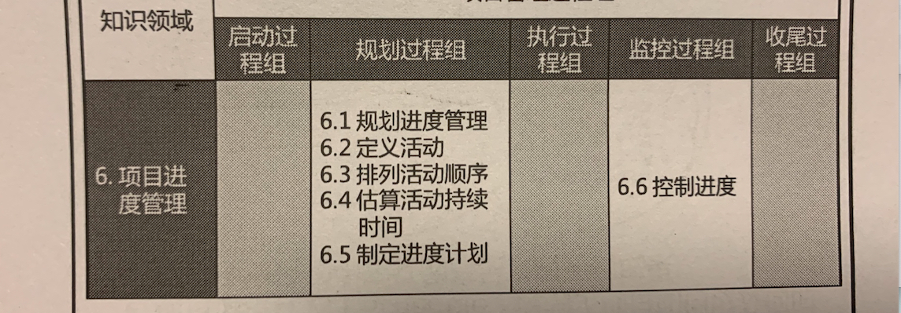

## 6.1 规划进度管理

过程定义：

为规划、编制、管理  、 执行和控制项目进度而**制定政策、程序和文档的过程**。

过程作用：

为如何在整个项目中管理项目进度提供指南和方向。

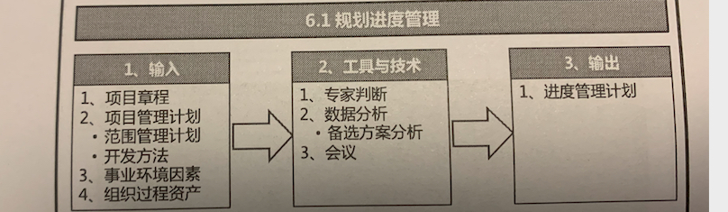

### 6.1.1 输入

- 项目章程
- 项目管理计划
  - 范围管理计划
  - 开发方法
- 事业环境因素
- 组织过程资产

### 6.1.2 工具和技术

- 专家判断
- 数据分析
  - 备选方案分析
- 会议

### 6.1.3 输出

- 进度管理计划
  - 作为项目管理子计划之一
  - 为编制、监督和控制项目进度建立 准则和明确活动

**进度管理 计划对下列活动作出规定**：

  -  项目进度模型制定 -  以关键路径法为主。
  - 进度计划的发布和迭代长度 - 使用时间盒周期
  - 准确度 - 活动持续时间估算的可接受区间 和应急储备
  - 计量单位 - 每种资源的计量单位
  - 组织程序链接 - WBS提供了框架
  - 项目进度模型维护 - 更新状态 ，记录进展
  - 控制临界值 - 允许的最大偏差
  - 绩效测量规则 - 挣值管理规则。如： EVM技术、固定公式法 完成百分比等。
  - 报告格式 - 进度报告的格式和编制频率。

## 6.2 定义活动

过程定义：

**识别和记录为完成项目可交付成果而须采取的具体行动的过程**。

过程作用： 

**把工作包分解为进度活动**，作为对项目工作进行估算、规划、执行、监督、控制的基础。

- 工作包需要通过活动来实现
- 活动代表着为完成工作包所需的工作投入。

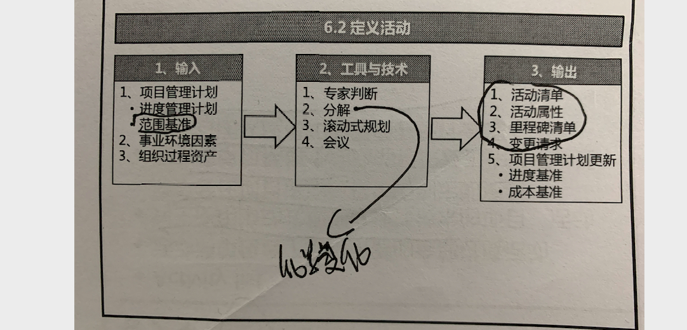

### 6.2.1 输入

- 项目管理计划
  - 进度管理计划
  - 范围基准
- 事业环境因素
- 组织过程资产

### 6.2.2 工具和技术

- 专家判断
- 分解
- 滚动式规划
- 会议

关于分解：

- 是把项目范围和可交付成果逐步划分为更小、更便于管理的组成部分的技术
- 活动表示完成工作包所需的投入
- WBS和WBS词典是制定最终活动清单的基础
- WBS中的每个工作包都应该分解为活动。
- 团队成员参与分解，有助于更好、更准确的结果。

关于滚动式规划：

- 详细规划近期要完成的工作， 同时在较高层级上粗略规划远期工作
- 适用于工作包、规划包、以及采用敏捷或瀑布式(预测型)方法的发布规划。
- 在生命周期的不同阶段，工作的分解详细程度会有所不同

### 6.2.3 输出

- 活动清单
  - 关于活动清单要注意如下方面：
    - 包含了项目所需的全部进度活动。
    - 对于滚动式规划的项目或者敏捷技术的项目，活动清单会在项目进展过程中得到定期更新。
    - 活动清单包括每个活动的标识及工作范围标书，使项目团队成员知道需要完成什么工作。

- 活动属性
  - 关于活动属性要注意如下方面：
    - 活动属性是指每项活动所具有的的多重属性，用来扩充对活动的描述。
    - 活动属性随着时间演进。
      - 项目初始阶段时，活动ID， WBS标识、活动标签 或名称
      - 活动编制完成时， 活动描述，紧前活动，紧后活动，逻辑关系，提前量，滞后量，资源需求，强制日期，制约因素，假设条件等。
    - 活动属性可用于：
      - 确定开展工作的地区和地点。
      - 编制开展活动的项目日历
      - 明确活动的投入类型。
        - 支持型 - 资讯、客户沟通 成本核算
        - 独立型 - 典型的项目活动
        - 依附型 - 后勤 ，行政  保洁 等。
      - 编制进度计划。

- 里程碑清单( 里程碑在甘特图中用 **◇** 标识， 里程碑的持续时间为0，里程碑清单中包含了所有的项目里程碑)

- 变更请求

一旦定义项目的基准后，在将可交付成果渐进明细为活动的过程中，可能会发现 原本不属于项目基准的工作，这样就会提出变更请求。在这情况下，应该通过实施整体变更控制过 程(见 4.6 节)对变更请求进行审查和处理。

## 6.3 排列活动顺序

过程定义：

识别和记录项目活动之间的关系的过程。

过程作用：

定义工作之间的逻辑顺序。以便在既定的所有项目制约因素之下获得最高的效率。

本过程旨在将项目活动列表转化为图表， 作为发布进度基准的第一步。

可以通过项目管理软件、手动或自动技术，来排列活动顺序。

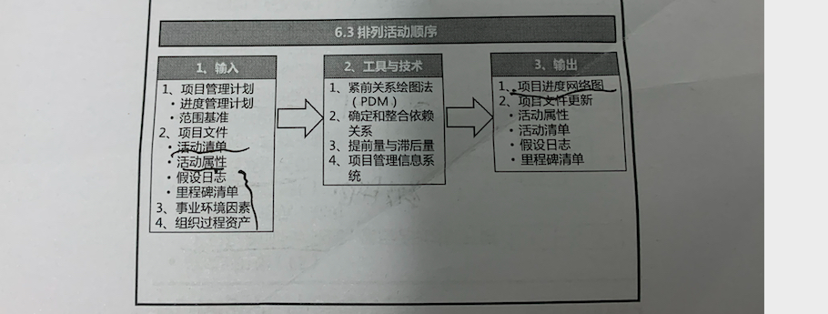

紧前关系绘图法(PDM)：

用节点表示活动，用一种或多种逻辑关系连接活动，以显示活动的实施顺序。

大多数项目管理软件使用该绘图法。

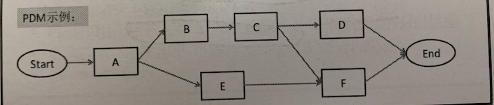

**PDM的四种逻辑关系**：

完成到开始 FS ： 只有紧前活动结束， 紧后活动才能开始。挖坑---栽树

完成到完成FF： 只有紧前活动完成，紧后活动才能完成。  **强调同时结束**。 

开始到开始SS： 只有紧前活动开始， 紧后活动才能开始， **强调同时开始**

开始到完成SF： 只有紧前活动开始， 紧后活动才能完成。 **强调无缝衔接**， 比如： 新系统上线-- 老系统下线。

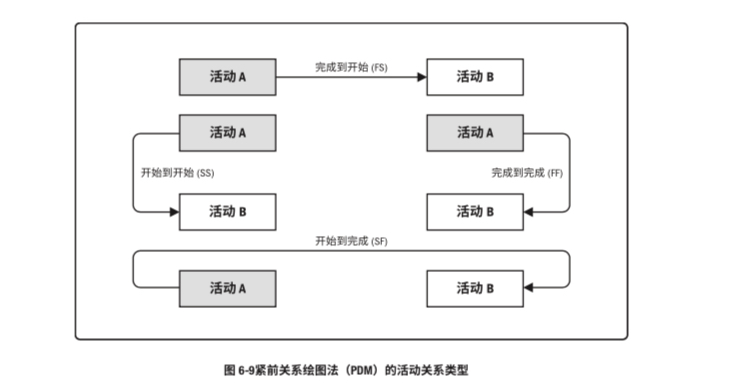

虽然两个活动之间可能同时存在两种逻辑关系(例如 SS 和 FF)，但不建议相同的活动之间存在多 种关系。因此必须做出选出影响最大关系的决定。此外也不建议采用闭环的逻辑关系。

**确定和整合依赖关系：**

依赖关系可能是强制或选择的，内部或外部的。这四种依赖关系可以组合成强制性外部依赖关系、强制性内部依赖关系、选择性外部依赖关系或选择性内部依赖关系

- 强制性 ，法律或合同要求的或工作的内在性质决定的依赖关系，往往与客观限制有关。
- 选择性。例如，根据普遍公认的最佳实践，在建造期间，应先完成卫生管 道工程，才能开始电气工程。这个顺序并不是强制性要求，两个工程可以同时(并行)开展工 作，但如按先后顺序进行可以降低整体项目风险
- 外部 ，外部依赖关系是项目活动与非项目活动之间的依赖关系，这些依赖关系往往不 在项目团队的控制范围内。例如，软件项目的测试活动取决于外部硬件的到货
- 内部  内部依赖关系是项目活动之间的紧前关系，通常在项目团队的控制之中。 例如，只有机器组装完毕，团队才能对其测试，这是一个内部的强制性依赖关系

**提前量和滞后量：**

提前量是相对于紧前活动，紧后活动可以提前的时间量。(FS-2周)

滞后量是相对于紧前活动，紧后活动需要推迟的时间量。(SS+15天)。

在进度计划软件中，提前量往往表示为负滞后量。

提前量和滞后量的使用不能替代进度逻辑关系

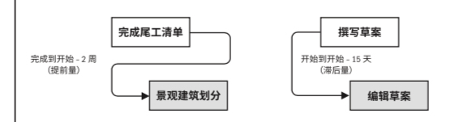

**项目进度网络图：**

表示项目进度活动之间的逻辑关系的图形。

没有时间刻度，亦称为“纯逻辑图”。

应附有简要文字描述，说明排序基本方法和异常序列。

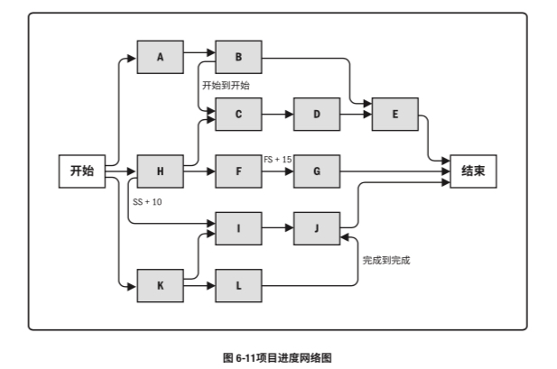

## 6.4 估算活动持续时间

过程定义：

根据资源估算的结果， 估算完成单项活动所需工作时段数的过程。

过程作用：

确定完成每个活动所需花费的时间量，为制定进度管理计划提供主要输入。

估算活动持续时间依据的信息包括：

- 活动工作范围
- 所需资源类型
- 估算的资源数量
- 资源日历

估算应由项目团队中最熟悉具体活动的个人或小组来提供估算所需的各种输入。

估算时还需考虑：

- 收益递减规律
- 学习曲线
- 技术进步
- 员工激励 等。

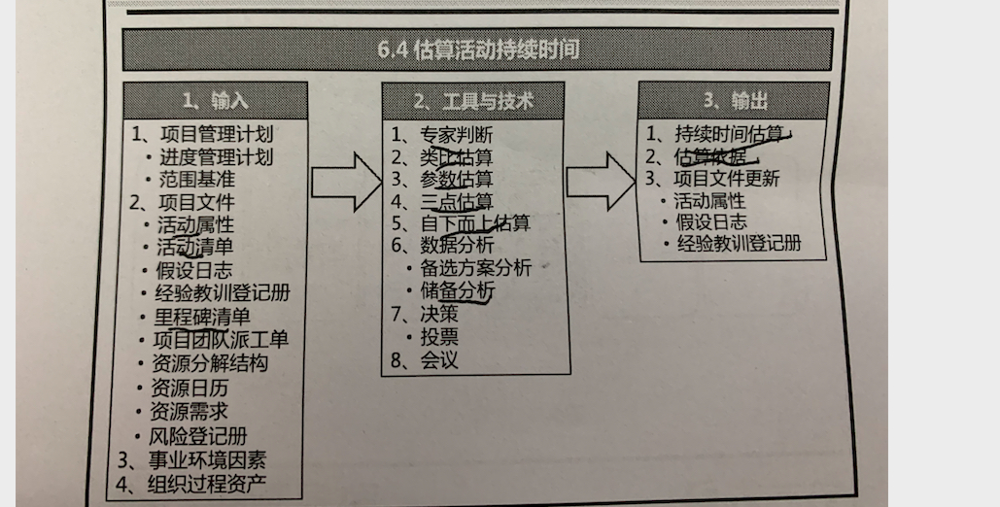

**类比估算：**

- 一种使用类似活动或项目的历史数据，来估算当前活动或项目的持续时间或成本的技术。
- 又称为自上而下估算， 是一种粗略估算。
- 当项目信息不足时， 经常使用该技术。
- 估算的可靠性取决于：
  - 以往项目在本质上的类似度。
  - 项目团队所具备的专业知识。
- 优点： 快速。 缺点： 准确性较差。

**参数估算**：

参数估算是一种**基于历史数据和项目参数**，**使用某种算法来计算成本或持续时间的估算技术**(如：回归分析， 学习曲线)。 它是指利用历史数据之间的统计关系和其他变量(如建筑施工中的平方英尺)，来估算诸如成本、 预算和持续时间等活动参数。

**三点估算**：

最可能时间(**tm**):  基于活动的最可能的情况

最乐观时间(**to**):  基于活动的最好情况

最悲观时间（**tp**）: 基于活动的最差情况。

期望时间   **te **  的数学含义是 在该时间内完成活动具有50%的概率。

计算期望时间 **te =（to+4 tm+tp）/6** (基于贝塔分布--缺省)       **te =（to+ tm+tp）/3**      (基于三角分布)

标准差： **δ=(to - tp)/6**

方差：**δ2=[(to - tp)/6)]2 **

以下是正态分布：

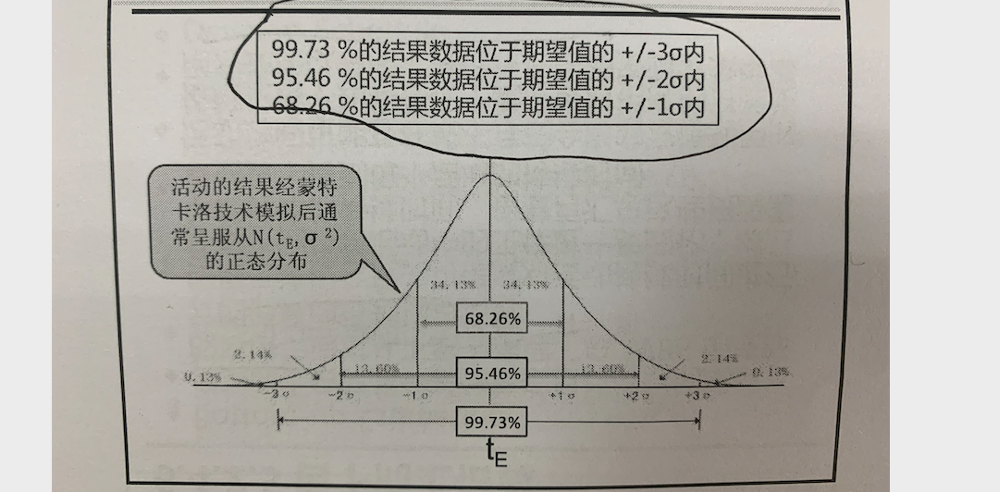

例题：

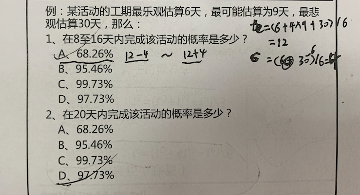

**自下而上估算：**

是一种估算项目持续时间和成本的方法，通过自下而上逐层汇总WBS组成部分的估算而得到项目估算。

**储备分析：**

储备分析用于确定项目所需的应急储备和管理储备。

- 应急储备应该包含在进度基准中， 已应用 已知的未知 风险。用来应对项目范围中不可预见的工作。
- 应急储备可以取活动持续时间估算的某一百分比或某一时间段。
- 随着项目信息越来越明确，可以动用 或减少 或取消应急储备。
- 管理储备是为管理控制的目的而特别留出来的项目预算， 以应对 未知的未知 风险。
- 管理储备不包括在进度基准中，但属于项目总持续时间的一部分。依据合同条款，使用管 理储备可能需要变更进度基准。

**决策：**
决策技术包括(但不限于)投票。举手表决是从投票方法衍生出来 的一种形式，经常用于敏捷项目中。采用这种技术时，项目经理会让团队成员针对某个决定示意支 持程度，举拳头表示不支持，伸五个手指表示完全支持，伸出三个以下手指的团队成员有机会与团 队讨论其反对意见。项目经理会不断进行举手表决，直到整个团队达成共识(所有人都伸出三个以 上手指)或同意进入下一个决定。

**会议：**

项目团队可能会召开会议来估算活动持续时间。如果采用敏捷方法，则有必要举行冲刺或迭代计划 会议，以讨论按优先级排序的产品未完项(用户故事)，并决定团队在下一个迭代中会致力于解决哪 个未完项。然后团队将用户故事分解为按小时估算的底层级任务，然后根据团队在持续时间(迭代) 方面的能力确认估算可行。该会议通常在迭代的第一天举行，参会者包括产品负责人、开发团队和项 目经理，会议结果包括迭代未完项、假设条件、关注事项、风险、依赖关系、决定和行动

**持续时间估算：**

持续时间估算是对完成某项活动、阶段或项目所需的工作时段数的定量评估，其中并不包括任何 滞后量，但可指出一定的变动区间。

- 2 周 ± 2 天，表明活动至少需要 8 天，最多不超过 12 天(假定每周工作 5 天)

**估算依据：**

持续时间估算所需的支持信息的数量和种类，因应用领域而异。不论其详细程度如何，支持性文件都应该清晰、完整地说明持续时间估算是如何得出的

## 6.5 制定进度计划

过程定义：

分析项目活动顺序、持续时间、自选需求和进度制约因素，**创建项目进度模型**， 从而落实项目执行与监控的过程。

过程作用：

为完成项目活动而制定具有计划日期的进度模型。(进度模型用来确定各项目活动和里程碑的计划开始时间和计划完成时间。)

制定**可行的项目进度计划**，往往是一个**反复进行的过程**。

**进度计划**获得**批准之后**， **成为进度基准**。 用于跟踪项目进度。

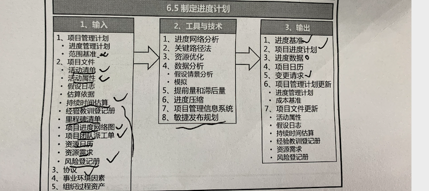

**进度网络分析**：

是创建项目进度模型的一种综合技术。综合了多重分析技术 如：关键路径法、 资源优化技术、建模技术等。其他技术如：

- 当多个路径在同一时间点汇聚或分叉时，评估汇总进度储备的必要性，以减少出现进度落后 的可能性。
- 审查网络，看看关键路径是否存在高风险活动或具有较多提前量的活动，是否需要使用进度储 备或执行风险应对计划来降低关键路径的风险

进度网络分析是一个反复进行的过程，一直持续到创建出可行的进度模型。

只有经过综合分析后的进度模型才能成为现实可行的技术计划，其他方法都太片面。

**关键路径法(CPM)：**

是在进度模型中， 估算项目最短工期， 确定逻辑网络路径的进度灵活性大小的一种方法。

该方法在不考虑任何资源限制的情况下，沿进度网络路径推进或者逆推分析，计算出所有活动的最早开始 ES、 最早结束EF、 最晚开始LS、最晚结束LF的日期。

- 关键路径是项目中时间最长的活动顺序，决定着可能的项目最短工期。
- 一个项目可能存在多条关键路径。
- 多条关键路径意味着项目风险增加及灵活性增加。
- 仅次于关键路径长度的路径 成为次关键路径。
- 项目经理应该重点关注关键路径上的活动。
- 浮动时间 又称为时差。slack
  - 总浮动时间，是某活动可以从最早开始时间推迟或延误的时间，该延误时间不至于延误项目完工日期或违反进度制约因素。
    - 正常情况下，关键路径的总浮动时间为0，
  - 自由浮动时间，是指某活动在不延误任何紧后活动最早开始时间或者进度制约因素的前提下，某活动可以推迟的时间量。

**资源优化技术：**

- 资源平衡

  - 为了在资源需求和资源供给之间取得平衡，根据资源制约 对 开始日期 和结束日期进行调整的一种技术。
  - 为了克服特定时间内资源数量有限或过渡分配。
  - 其往往导致 关键路径钙片， 通常是延长。

  例如：

  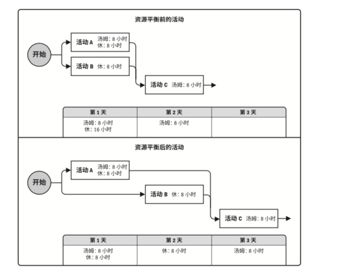

- 资源平滑
  - 对活动自身进行调整，从而使项目资源需求不超过预定的资源限制的一种技术。
  - 其不会改变项目关键路径，完工日期不会推迟。
  - 活动只在自由 和 总浮动时间内延迟。(只调整非关键路径上的活动)
  - 资源平滑无法实现所有资源的优化。

**数据分析**：

- 假设情景分析
  - 对各种情景进行评估，预测它们对项目目标的影响(积极或消 极的)。假设情景分析就是对“如果情景 X 出现，情况会怎样?”这样的问题进行分析，即基 于已有的进度计划，考虑各种各样的情景。例如，推迟某主要部件的交货日期，延长某设计工 作的时间，或加入外部因素(如罢工或许可证申请流程变化等)
  - 是为应对意外情况的影响而准备进度储备和应对计划。
- 模拟
  - 是把单个项目风险和不确定性的其他来源 模型化的方法，  以评估对项目目标的潜在影响。
  - 最常见的模拟技术是模特拉罗分析。

**进度压缩：**

是不缩减项目范围的前提下，缩减工期以满足进度要求。

- 赶工 - 增加资源，以最小的成本增加 来压缩工期。适用于增加资源就能缩减时间，且位于关键路径上的活动 可能导致风险、成本增加。
- 快速跟进 - 活动或者阶段 并行开展。  适用于能够通过并行活动缩短工期的情况。 可能导致质量风险、成本增加。

注意： 赶工要注意收益递减规律， 同时要选择成本最低的方案。

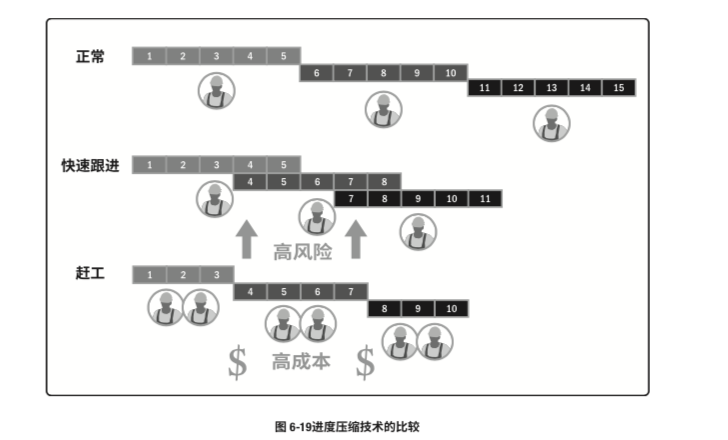

**敏捷发布规划：**

是基于项目路线图和产品发展愿景，提供了一个高度概括的发布进度时间线。(通常3-6个月)

