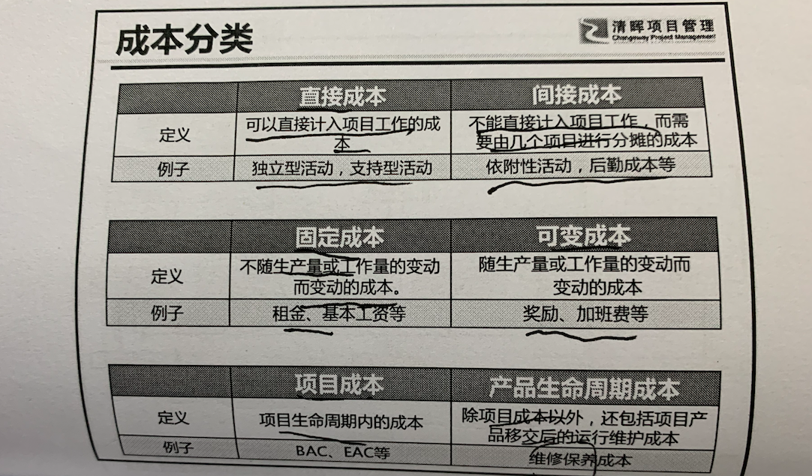
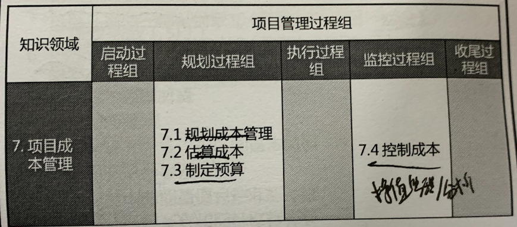
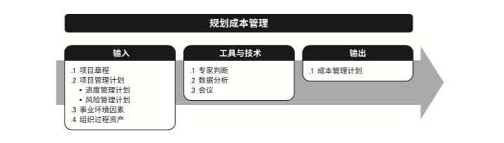
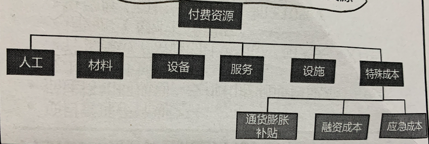
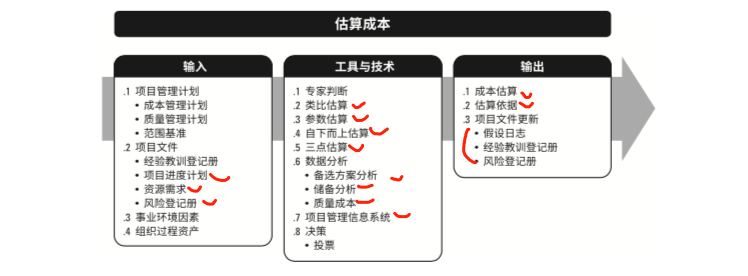
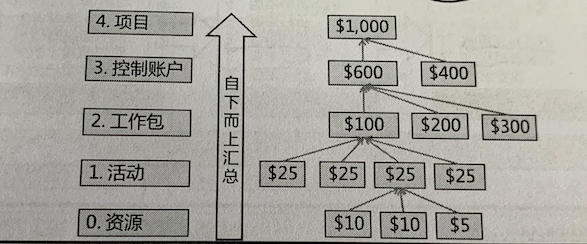
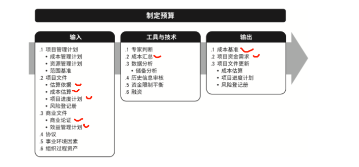
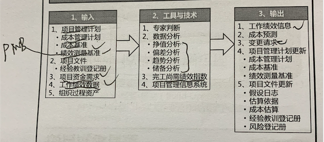

# 7 项目成本管理

项目成本管理包含为使项目在批准的预算内完成而对成本进行规划、估算、预算、融资、筹资、管理和控制的各个过程。

目的： 确保项目在**批准的预算内(成本基准)**完工

其重点关注完成项目活动所需资源的成本， 同时也要考虑到项目决策对成本的影响。

通常分析预测项目产品的财务效益是在成本管理之外进行。(例外：固定资产投资项目)

发展趋势和新兴实践：

**对挣值管理(EVM)进行扩展，引入挣得进度(ES)概念。**

敏捷和适应性环境考虑因素：

采用轻量级估算方法 快速生成对项目人力成本的预测。 

常见的几个成本的对比：

该部分的主要过程如下：

## 7.1 规划成本管理

过程定义：

确认如何估算、预算、管理、监督和控制项目成本的过程。

过程作用： 

在整个项目中为如何管理项目成本提供指南和方向

**应在**项目**规划**阶段**早期**就**对成本管理工作进行规划**， **建立各成本管理过程的基本框架**， 以**确保各过程之间的协调性**。

**成本管理计划：**

- 是项目管理子计划之一
- 描述如何规划、安排 和控制项目成本
- 成本管理计划中规定：
  - 计量单位 （资源的计量单位，如： 人天、人月等）
  - 精确度 （设定成本估算向上或向下取整的程度， 例如 995.59 美元取 整为 1,000 美元）
  - 准确度 （为活动成本估算规定一个可接受的区间， 如：±10%）
  - 组织过程链接 （WBS工作分解结构为成本管理计划提供了框架，据此开展 成本估算、预算和控制。在成本核算中使用的 WBS 组成部分，称为控制账户CA）
  - 控制临界值 （通常用偏离基准的百分数）
  - 绩效策略规则
    - 定义WBS用于绩效测量的控制账户。
    - 挣值测量技术 （加权里程碑法、 固定公式法、 完成百分比等）
    - 规定跟踪方法 ，以及用于计算项目完工估算(EAC)的 EVM 公式，该公式计算出的结果可用 于验证通过自下而上方法得出的完工估算。
  - 报告格式，（定各种成本报告的格式和编制频率）
  - 其他细节
    -  对战略筹资方案的说明 （**融资**程序）
    - 处理汇率波动的程序 （**汇率波动应对**程序）
    - 记录项目成本的程序 （**记录项目成本**程序）

## 7.2 估算成本

过程定义：

**对完成项目**工作  **所需资源成本**  进行**近似估算**的过程。

过程作用：

确定项目所需的资金

通常采用货币单位， 也可采用人时数或者人天数。

可在活动层级呈现，也可以汇总形式呈现。

**成本估算应该考虑将向项目收费的全部资源**。 

关于估算的准确度

- 粗略估算。（-25% -- +75%） 
- 预算估算 （-10%--  +25%） 自上而下估算/类比估算
- 确定性估算。（-5% --+10%） 根据WBS自下而上估算

备注： 此部分的输入的 事业环境因素可能为(市场条件、 汇率和通胀因素)

**自下而上估算：**

是对工作组成部分进行估算的一种方法，首先对单个工作报告或活动的成本进行最具体、最喜之的估算，然后把这些细节成本向上汇总或滚动到更高层次。自下而上估算的准确性及其本身所需的成本，通常取决于单个活动或工作包的规模或 其他属性。

**三点估算：**

- 类似于项目进度管理中的三点估算。

**储备分析：**

- 为应对成本方面的不确定性和风险，库算是需要考虑应急储备。

- **应急储备包含在成本基准中，用来应对已经接受的已识别的风险。**

- 管理储备是为管理控控制的目的而特别流出来的项目预算，应对未知的未知 风险。 不包含在成本基准中，但属于项目总预算的一部分。

成本估算：

- 是对完成项目工作可能需要的成本、应对已识别风险的应急储备、应对未识别风险的管理储备的量化估算。

估算依据：

- 是对成本估算所做的支持性说明文件。

## 7.3 制定预算

过程定义：

汇总所有单个活动或工作报告的估算成本，建立一个经批准的成本基准的过程。

过程作用：

确定成本基准，可以据此监督和控制项目绩效。

成本基准是经过批准且按照时间段分配的项目预算，但不包括管理储备。

只开展一次 或 在项目的指定时间点开展。

**成本汇总：**

**历史信息审核：**

审核历史信息有助于进行参数估算 或 类比估算的历史关系。

历史信息可包括各种项目特征(参数)，(它们用于建立数学模型，预测总成本)

**资金限制平衡：**

根据对项目资金的任何限制 平衡资金支持。

如果发现资金限制和计划支持之间的差异， 则可能需要调整进度计划， 以平衡资金支出水平。

可通过在项目进度计划中添加强制日期来实现。

资金限制平衡的原因在于组织对于项目预算资金的拨付不是一次性全部到位。

**融资：**

- 是指从外部获取资金。

- 长期的基础设置、工业和公共服务项目通常需要寻求外部融资。

- 如果项目使用外部资金，出资实体可能会提出一些必须满足的条件。

**成本基准：**

- 成本基准是经过批准的，按时间段分配的项目预算。

- 成本基准不包括任何管理储备。
- 只有通过正式的变更程序才能变更。
- 用作与实际结果比较的依据。
- 是不同进度活动经过批准的预算的综合
- 根据活动计划，按照时间分配成本基准就得到一个S曲线。
- S曲线在挣值管理中既是成本绩效基准， 相当于PV线。
- 成本基准+ 管理储备 == 项目预算(又叫项目资金需求)。

## 7.4 控制成本

过程定义：

监督项目状态，以更新项目成本， 管理成本基准管更的过程。

过程作用：

在整个项目期间保持对成本基准的维护。

- 在成本控制中，应重点分析项目资金支出与相应完成的实际工作的关系

- 只监督资金的支出，而不考虑这些支出完成的工作，对项目没有意义。

- 有效成本控制的关键在于 管理经批准的成本基准。

  

  

  

**挣值分析：**

源于美国国防部，应用于民兵导弹计划。又来PMI对其进行改造，使EVM原理原则上适用于所有行业的所有项目

- 计划价值PV
- 挣值EV
- 实际成本AC

**偏差分析：**

- 进度偏差SV
- 成本偏差CV
- 进度绩效指数SPI
- 成本绩效指数CPI

**趋势分析：**

- 图表(S曲线)
- 预测(EAC)

