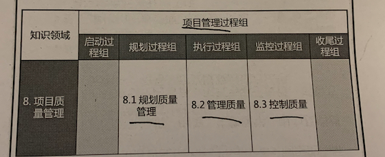
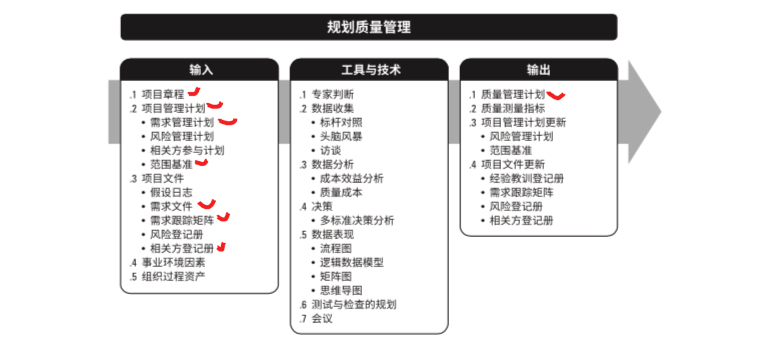
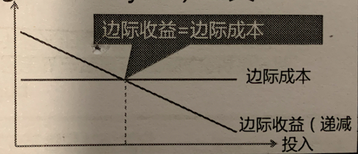
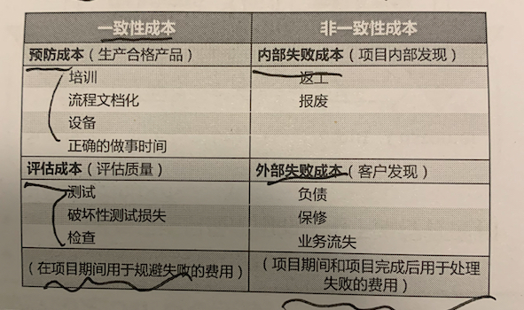
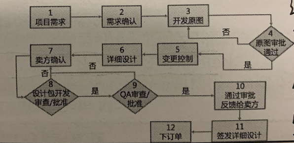
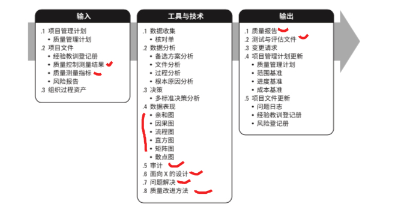
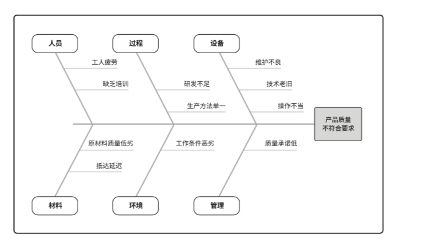
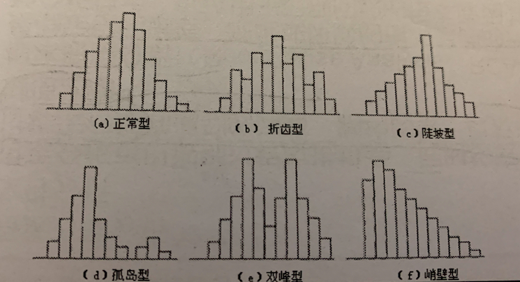
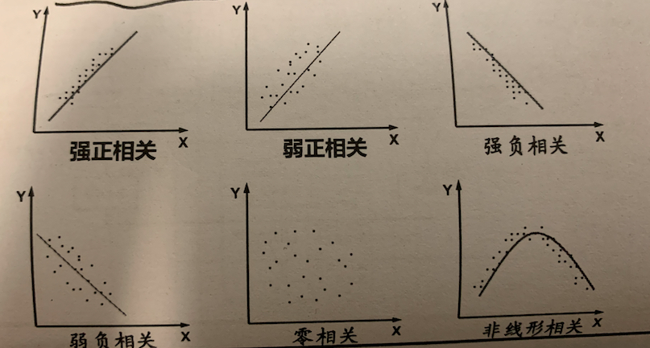
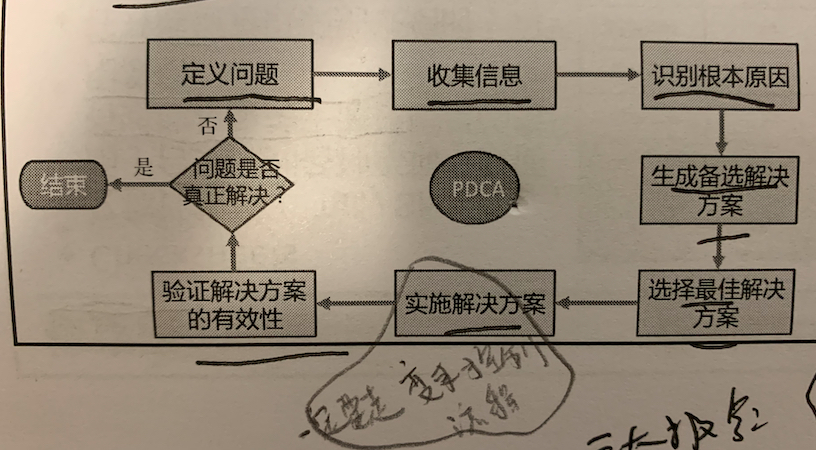

# 8 项目质量管理

项目质量管理以执行组织的名义支持过程的持续改进活动。

项目质量管理要兼顾项目管理和项目可交付成果两个方面。

质量的测量方法和技术则需要专门针对项目所产生的可交付成果而定。

质量和等级的联系：

- 低等级不是问题， 低质量一定是个问题。
- 低等级高质量的产品是许多厂商市场份额的重要杀手锏。
- 项目经理和项目管理团队负责权衡，以同时达到所要求的的质量和等级。

预防： 保证过程中不出现错误

检查：保证错误不落到客户手中。

属性抽样：表明结果为合格或不合格。比如：PMP考试结果为PASS or FAIL

变量抽样：用连续的量表上标明结果所处的未知，表示合格的程度。比如PMP成绩：5A  4A1T 5T

相关名人：

休哈特 -- 控制图的发明者，最早提出PDCA模型

戴明 - - 改进并完善PDCA环（戴明环）

石川馨 -- 石川图（鱼骨图，因果图）

质量管理的有效性演进：

- 由**客户发现**缺陷
  - 通过**质量控制过程** 检测和纠正缺陷
    - 通过质**量保证过程** 检查和纠正过程本身
      - 将**质量融入**项目和产品的**规划设计**中
        - 在**组织中创建**关注并致力于实现过程和产品质**量的文化**

发展趋势和新型实践：

- 客户满意
- 持续改进
  - PDCA循环是质量改进的基础
  - 方法： TQM(全面质量管理)  6西格玛(缺陷率是百万分支3.4)   精益6西格玛(同时关注减少浪费和消除变异，其思想又包括了 准时生产JIT， 看板管理等)
  - 模型： 马尔科姆波多里奇(美国国家质量大奖模型)、CMMI（常用与评估软件）

- 管理层的责任
- 和供应商的互利合作关系

裁剪考虑因素：

- 政策合规和审计
- 标准和法规合规性
- 持续改进
- 干系人参与

敏捷考虑因素：

- 定期回顾会议，检查质量过程的效果，寻找根本原因， 然后建议实施新的质量改进方法。
- 关注小批量工作，以便在早起发现不一致和质量问题。

## 8.1 规划质量管理

过程定义：

识别项目及其可交付成果的质量要求或标准，并书面描述项目将如何证明符合质量要求或标准的过程。

过程作用：

为整个项目中如何管理和核实质量提供指南和方向。

**成本效益分析：**

用来估算备选方案优势和劣势的财务分析工具，以确定创造最佳收益的备选方案。

常用边际分析工具。最佳的质量投入应该是收益增加和成本增加相等时的质量成本。

**质量成本(COQ)：**

质量成本指一致性成本和非一致性成本的总和。

- 一致性成本，在项目期间用于规避失败的费用。
- 非一致性成本，在项目期间和项目完成后，用于处理失败的费用。

**流程图：**

也称为过程图。

用来显示一个或者多个输入转化为一个或多个输出的过程中，所需要的步骤顺序和可能分支。

用于了解和估算一个项目可能的成本。

通过工 作流的逻辑分支及其相对频率来估算质量成本。这些逻辑分支细分为完成符合要求的输出而 需要开展的一致性工作和非一致性工作。

**逻辑数据模型**：

逻辑数据模型把**组织数据可视化，以商业语言加以描述**，不依赖任何特定技 术。逻辑数据模型可用于识别会出现数据完整性或其他质量问题的地方

**矩阵图：**

矩阵图在**行列交叉的位置展示因素、原因和目标之间的关系强弱**。根据可用来比较 因素的数量，项目经理可使用不同形状的矩阵图，如 L 型、T 型、Y 型、X 型、C 型和屋顶型矩 阵。有助于识别对项目成功至关重要的质量测量指标

**测试与检查的规划：**

在规划阶段，项目经理和团队 决定该如何测试或检查产品/可交付成果/服务。以满足干系人的需求和期望、产品的性能和可靠性指标。

不同行业的测试与检查：

- 软件行业。α测试，β测试 单元测试 集成测试 黑盒测试
- 硬件行业。  环境应力筛选、 老化测试 系统测试
- 建筑行业。 水泥强度测试、土壤实验等
- 制造行业  检查
- 工程行业  现场试验、 无损伤测试等。

**质量管理计划：**

- 项目管理子计划之一。
- 描述了如何实施适用的政策、程序、指南以实现项目目标。
- 也描述了项目团队为实现项目目标所需的活动和资源
- 包括：
  - 采用的质量标准
  - 质量目标
  - 质量角色和职责
  - 需要质量审查的可交付成果和过程
  - 为项目规划的**质量控制和质量管理互动**
  - 质量工具
  - 质量有关的主要程序。(处理不符合要求的情况、纠正措施程序、持续改进程序。)

**质量测量指标：**

专用于描述项目或产品属性，以及控制质量过程将如何验证符合程度。例如：

- 按时完成任务的百分比
- 已CPI测量的成本绩效
- 故障率
- 每日缺陷数量
- 测试覆盖度。等

### 8.2  管理质量

管理质量等价于 质量保证

过程定义：

把组织的质量政策应用于项目，并将质量管理过程转化为可执行的质量活动的过程。

过程作用：

提高实现质量目标的可能性，以及识别无效过程和导致质量低劣的原因。

管理质量过程包括所有的质量保证活动，还与产品设计和过程改进有关。

管理质量的工作属于质量成本框架中的一致性工作。

管理质量过程有助于：

- 执行特定设计准则，设计最优的成熟产品。 **设计最优的产品**
- 建立信心，相信通过质量保证工具(如质量审计和故障分析) 能使未来输出在完工时满足特定的需求和期望。**建立对质量保证工具的信息。**
- 确保使用质量过程并使用能够满足项目的质量目标。  **确保按照既定质量目标开展质量过程**
- 提高过程和活动的效率和效果，以过得更好的成果并提高干系人满意度。 **提高效率效果，和干系人满意度**

**质量控制测量结果：**

质量控制测量结果用于分析和评估项目过程和可交付成果的 质量是否符合执行组织的标准或特定要求。质量控制测量结果也有助于分析这些测量结果的产 生过程，以确定实际测量结果的正确程度

**质量测量指标**：

核实质量测量指标是控制质量过程的一个环节。管理质量过程依 据这些质量测量指标设定项目的测试场景和可交付成果，用作改进举措的依据

**过程分析：**

可以识别过程改进机会，同时检查在过程期间遇到的问题、制约因素， 以及非增值活动(不产生价值，但一般无法避免的活动)。

**根本原因分析(RCA):**

是确定引起偏差、缺陷或风险的根本原因的一种分析技术.用于识别 问题的根本原因并解决问题。消除所有根本原因可以杜绝问题再次发生.

常用方法： 因果图、树状图、常用与RCA。

**因果图(石川图 鱼骨图)：**

把问题陈述放在鱼骨的头部作为起点， 用来追溯问题来源，回推到可行动的根本原因。

**直方图：**

是一种展示数字数据的图形，可以展示每个可交付成果的缺陷数量、缺陷原因的排列 各个过程不合规的数量。

**散点图（相关图）：**

解释因变量Y相对于自变量X的变化，可分别代表质量缺陷与可能导致质量缺陷的任何要素。

**审计：**

审计是用来确定项目活动是否遵循了组织和项目的政策 过程、程序的一种结构化独立的过程。

质量审计通常由项目以外的团队开展。如： 组织内部审计部门、PMO、组织外部审计师。

审计的目标：

- **识别**全部正在实施的**良好和最佳实践**
- **识别**全部**违规做法**、差距和不足
- **分享**所在组织/行业中的**良好实践**。
- **积极主动提供协助**，改进过程执行，从而帮助团队提高生产效率。
- 强调**每次**审计都**应对组织教训知识库的积累**做出贡献。
- 还可**确认已批准的变更的实施情况**。

**面向X的设计：（Dfx）**

design for x.  优化设计的特定方面，可以控制和提升产品的最终特性。

X可以是可靠性、调配、制造、成本 服务 可用性等。

使用Dfx 可以降低成本 、改进质量、 提高绩效 和客户满意度。

**问题解决：**

使用结构化的问题解决方法， 有助于消除问题和制定长久有效的解决方案。

**质量改进方法：**

PDCA 和六西格玛 是最常见的分析和评估改进方法的质量改进工具。

**质量报告：**

- 可以包括团队商报的质量管理问题、改进建议、纠正建议 等。
- 可以是图形、数据 或定性文件。

测试与评估文件：

- 可基于行业需求和组织模板创建测试与评估文件，用于评估质量目标的实现情况。

## 8.3 控制质量

