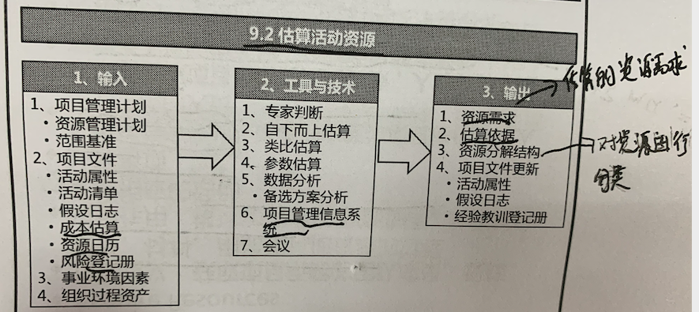
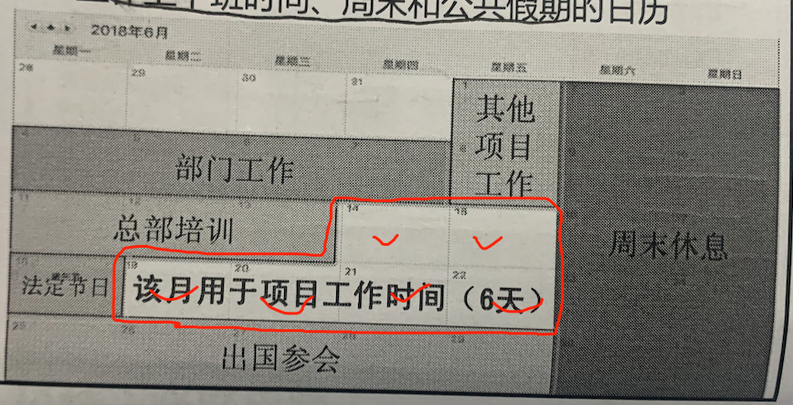
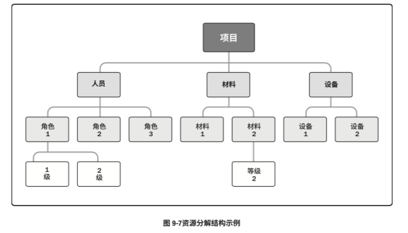
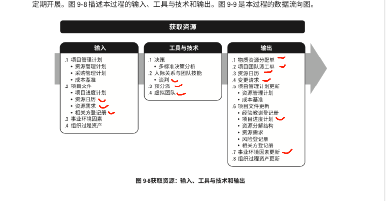
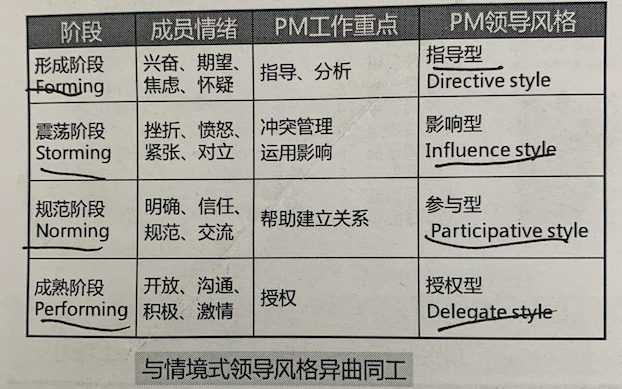
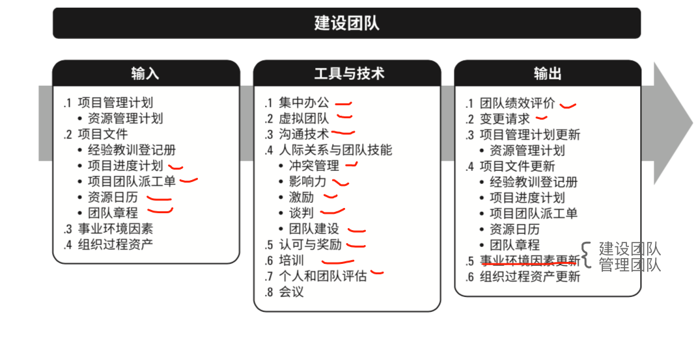
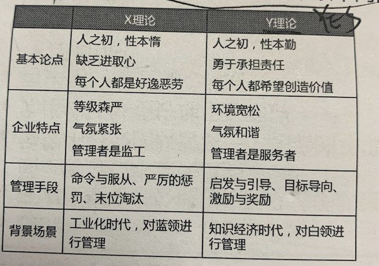
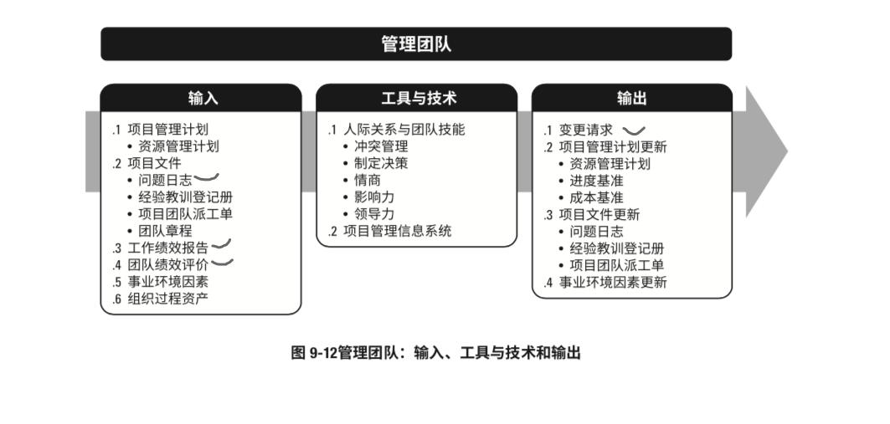
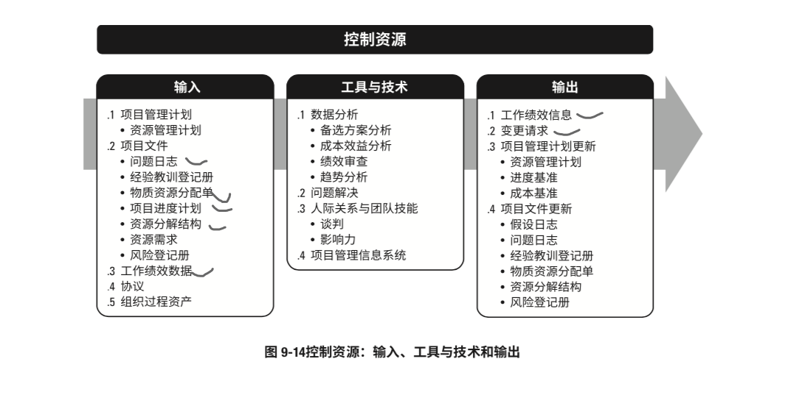

# 9 项目资源管理

宗旨：

在正确的时间 正确的地点 用正确的资源

资源主要分为实物资源(设备、材料和基础设置) 和 人力资源(团队资源)。

团队资源管理相比于实物资源管理，对项目经理提出了不同的技能和能力要求。

团队资源管理 和项目干系人管理有重叠的部分， 本章重点关注组成项目团队这部分的干系人。

项目经理应在获取、管理、激励和授权团队方面投入适当的努力。

项目经理负责建设高绩效团队。

事务资源着眼于以有效率有效果的方式，分配和使用 成功完成项目所需的实物资源。

不能有效管理 和 控制资源  是项目的风险来源之一。

发展趋势 和新型实践： 赋能。

敏捷考虑因素：    通才的自组织团队 以及 具有协作精神的团队。

过程构成：

## 9.1 规划资源管理

过程作用：

根据项目类型和复杂程度确定适用于项目资源的管理方法和管理程度。

资源规划用于确定和识别一种方法，以确保项目的成功有足够的可用资源。

资源可以从组织内部获得， 或者通过采购从外部获取。

需要考虑稀缺资源(人/物)对项目造成的显著影响

**数据表现：**

可通过多种格式来记录和阐明团队成员的角色和职责。

确保每个工作报告都有明确的责任人。

去报全体成员清楚理解其角色和职责。

主要三种形式：  层级性 、RAM  、文本型

层级型：(典型表现OBS(组织分解结构))

RAM型及 RACI(扩展图)：

旨在把所有工作落实到人

文本型：

**组织理论：**

组织理论阐述个人、团队和组织部分的行为方式。

不同的组织结构 展现不同的交际特点。

根据组织理论灵活运用领导风格。

**资源管理计划：**

提供了关于如何分类、分配、管理和释放项目资源的指南。包括：

- 识别资源
- 获取资源
- 角色和职责
- 项目组织图。-组织架构图
- 项目团队资源管理，(关于如何定义  配备  管理 和最终如何遣散团队资源的指南)
- 培训
- 团队建设
- 资源控制
- 认可计划(讲给与团队成员哪些认可和奖励， 以及何时给与)

**团队章程：**

是为团队创建 团队价值观、公式和工作指南的文件。

- 团队价值观
- 沟通指南
- 角色标准和过程
- 出图鼓励过程
- 会议指南
- 团队共识等。

其对项目团队成员的可接受行为确定了明确的期望。 尽早指定可以提高生产力，减少五绝。

## 9.2 估算活动资源

过程定义： 

估算执行项目工作所需的团队资源、以及材料设备和用品的类型和数量的过程。

本过程和估算成本过程密切相关。

**资源日历：**

- 资源日历识别了每种具体资源的可用工作日或工作班次的日历。
- 估算活动资源需求的时候， 需要了解规划的活动期间 哪些资源可用， 哪些资源不可用。 可用多久。

**风险登记册：**

可能影响资源选择 和 可用性的各种风险。

**事业环境因素：**

- 资源可用性
- 团队资源的技能
- 市场条件等。

**PMIS：**

有助于规划、组织管理资源库    编排资源估算

**会议：**

项目经理和职能经理一起举行规划会议，以估算每项活动所需的资源 团队资源的技能水平。 以及所需材料的数量

**资源需求：**

活动资源需求 明确了每个工作报告 或工作报告中的每个活动所需的资源类型与数量。

并将这些需求汇总为每个工作包和每个WBS分支以及整个项目所需的资源估算。

**资源分解结构(RBS)：**

是资源依类别和类型的层级展现。

类别包括： 人力 材料  设备/用品 等。

类型包括： 技能水平、 等级水平、 等。

**项目文件更新：**

- 活动属性，活动属性依据资源需求而更新
- 假设日志 。 项目所需资源的类型和数量的假设条件，更新在假设日志中。此外，任何资源制约因素，包括集体劳资协议、连续工作时间、计划休假等，也应当相应更新。
- 经验教训登记册   能够有效和高效地估算资源的技术，以及有关那些无效或低 效的技术信息，更新在经验教训登记册中。

## 9.3 获取资源

过程定义：

获取项目所需的团队成员、设施、设备 材料 和其他资源的过程。

注意事项：

- 进行有效谈判， 影响那些能为项目提供所需人力资源的人员。
- 不能获得所需的人力资源， 人力资源不足 或人员能力不足， 都会对项目造成影响。
- 如因制约因素无法获得所需人力资源，项目经理不得不使用替代资源。(招募 == 外包)

项目所需资源可能来自项目执行组织的内部或者外部。 内部由职能经理或资源经理负责分配。 外部资源则通过采购过程获得。

本过程在整个项目期间 **定期开展。**

**决策：**

- 多标准决策分析(包括但是不限于)， 通过多标准决策分析制定出决策标准， 对潜在资源综合评级打分。根据各种因素对团队的不同重要性。 赋予不同标准不同的权重：
  - 可用性、 成本、 能力
  - 经验 知识 技能 态度  国际因素
  - 。。。

 

**人际关系与团队技能：**

- 谈判。 很多项目需要针对所需资源进行谈判   项目经理需要与下列各方进行谈判。
  - **职能经理**       确保项目在要求的时限内获得最佳资源，直到完成职责
  - **执行组织中的其他项目管理团队**        合理分配稀缺或特殊资源   (和其他项目团队争资源，尤其是复用资源)
  - **外部组织或供应商**   - 获取各类特殊资源 或实物资源

资源分配谈判中，项目管理团队影响他人的能力很重要，如同在组织中的政治能力一样重 要。例如，说服职能经理，让他/她看到项目具有良好的前景，会影响他/她把最佳资源分配给这 个项目而不是竞争项目。

**预分派：**

指实现确定项目的实物或团队资源。

在下面情况下可能发生：

- 竞标过程中，承诺分派特定人员进行项目工作。
- 项目取决于特定人员的专有技能  --- 其他人做不利。
- 在完成项目资源管理计划之前， **项目章程**或其他过程 **指定了某些团队成员的工作分配**。

**虚拟团队：**

具有共同目标， 但是很少或者没有时间面对面工作的一群人。

虚拟团队中， 沟通规划 尤为重要。

**实物资源分配单**：

记录了项目将使用的材料  设备 用品 地点  和其他实物资源。

**项目团队派工单：**

项目团队派工单记录了团队成员及其在项目中的角色和职责，可包括项目团队名录，还需要把

人员姓名插入项目管理计划的其他部分(就是把人的信息更新进去)。如：

- 项目团队名录

- 项目组织图
- 进度计划

**变更请求：**

获取资源过程中出现变更请求(例如影响了进度)，或者推荐措施、纠正措 施或预防措施影响了项目管理计划的任何组成部分或项目文件，项目经理应提交变更请求，且应 该通过实施整体变更控制过程(见 4.6 节)对变更请求进行审查和处理。

项目管理计划更新：

- 资源管理计划
- 成本基准  。项目资源获取期间，成本基准可能发生变更

## 9.4 建设团队

过程定义：

提高工作能力， 促进团队互动，改善氛围，已提高项目绩效的过程。

过程作用：

改进协作， 增强人机关系技能， 激励团队  减少摩擦，提升项目整体绩效。

**建设高效的项目团队是项目经理的主要职责之一。**

建设项目团队的目标包括：

- 提高成员的知识和技能 -- 培训
- 提高成员之间的信任和认同感 
- 创建富有生气 凝聚力  协作性的团队文化。
- 提高团队参与决策的能力 --- 最大化的透明。

没有完美的个人， 只有完美的团队。

团队建设通常要经历5个阶段，通常按顺序进行，可能跳跃，逆转。  塔克曼团队发展五阶段理论：

- **形成**  开始认识， 开始了解项目职责，不开诚布公 ， **相互独立，**
- **震荡**  磨合期，没有凝聚力， **相互对立**  ， 彼此竞争。
- **规范**  **相互信任**， 协同工作， 共同解决问题。
- **成熟**  **相互依靠**，  完善阶段， 彼此谈成， 高效解决问题。
- **解散**  团队完成所有工作，  团队成员离开项目。

各个阶段适用的领导风格：

马斯洛需求层次理论：

- 自我实现需求 --  学习  发展 自我实现
- 尊重需要  --  成就  引人注目 （升值加薪）
- 社会需要  -- 爱情 友情    归属  认同
- 安全需要   -- 免受伤害
- 生理需要 --   温饱

双因素理论：

只有激励因素才能够给员工带来满足感，保健因素只能消除员工的不满， 但不会带来满足感。

X/Y理论：

**集中办公（也叫紧密矩阵）：**

可以临时， 也可以贯穿整个项目。在特别重要的时期， 可以采用作战室的集中办公形式

**虚拟团队：**

具有共同目标， 但是很少或者没有时间面对面工作的一群人。

虚拟团队中， 沟通规划 尤为重要。

**沟通技术：**

可以采用的沟通技术包括 共享门户 视频会议，  音频会议， 邮件    聊天软件。

**人际关系与团队技能：**

- 冲突管理
- 影响力
- 激励
- 谈判
- 团队建设 
  - 举办活动
  - 正式、非正式的沟通和活动

**认可与奖励：**

对成员的优良行为 给予认可和奖励。

最初的奖励计划应该再资源管理计划中已编制。

只有满足了被奖励者的某个重要需求的奖励才是有效的。  而且应考虑文化的差异。

**培训：**

旨在提高团队成员的能力。

计划内培训- 资源管理计划内的。

计划外培训

培训成本应该纳入项目或组织预算。

**个人和团队评估**：

个人和团队评估工具能让项目经理和项目团队了解到成员的优势和劣势，增进团队成员的理解沟通 信任， 提高团队绩效。工具包括：

- 态度调查
- 细节评估
- 结构化面谈
- 能力测试
- 焦点小组等

**团队绩效评价：**

随着项目的进展， 项目管理团队对项目团队的有效性进行评价。 标准包括：

- 个人技能的改进
- 团队能力的改进
- 团队成员离职率的降低
- 团队凝聚力的加强。

通过团队绩效评价，管理团队能识别出所需的特殊培训、教练、辅导 协助 或者改变， 以提高团队绩效。

**事业环境因素的更新**：

- 员工发展计划的记录
- 员工能力评估

**组织过程资产的更新**：

- 人事评测
- 培训需求

## 9.5 管理团队

过程作用：

跟踪团队工作表现， 影响团队行为、管理冲突以及解决问题

优秀项目经理应向项目成员分配富有挑战性的任务， 并对优秀绩效进行表彰。

**问题日志：**

在管理项目团队过程中，总会出现各种问题。 可用问题日志记录谁负责在目标日期内解决问题，并监督解决情况。

**工作绩效报告：**

工作绩效报告是为制定决策、采取行动或引起关注所形成的实物或电子工作绩效 信息，它包括从进度控制、成本控制、质量控制和范围确认中得到的结果，有助于项目团队管理。 绩效报告和相关预测报告中的信息，有助于确定未来的团队资源需求，认可与奖励，以及更新资源 管理计划

**冲突管理：**

为解决冲突 而对冲突情形进行的处理、控制 和指导。

合理的冲突是有益的。

冲突的七大来源：

- 进度
- 项目优先级
- 资源
- 技术意见
- 行政程序
- 成本
- 个性。

在项目启动、规划阶段的特殊顺序：

- 项目优先级
- 进度
- 下面相同。

冲突的五大解决办法：(应该首选非正式 私下解决)

- 合作解决  综合考虑不同观点和意见， 采取合作的态度 和开放式对话引导各方达成共识和承诺。 （最好）
- 妥协/调节 。（各退一步，寻找各方都一定程度上满意的答案。 A  B  ---> c）
- 缓和/包容 - （求同存异，找共同点）
- 撤退/回避 （都别争了， 一会再说）
- 强迫/命令.  快速解决。  牺牲其他方为代价， 推行某一方的观点。(最差)

**制定决策：**

决策包括谈判能力以及影响组织与项目管理团队的能力，而不是决策 工具集所描述的一系列工具。进行有效决策需要：

- 着眼于要达到的目标
- 遵循决策流程
- 研究环境因素
- 考虑风险
- 。。。

**情商：**

是指识别、评估 和管理自己和他人的情绪，以及人群团体的集体情绪。

人的主要三种商：  智商 情商 逆商。

**影响力：**

在矩阵环境中， 项目经理权利小，所以他们适时影响干系人的能力，对项目成功非常关键。

主要体现在如下方面：

- 说服别人
- 清晰表达自己的观点
- 积极且有效倾听。
- 了解并综合考虑各方观点。
- 收集相关信息 以解决重要问题， 维护相互信任并达成一致意见。

**项目信息管理系统：**

项目管理信息系统可包括资源管理或进度计划软件，可用于在各个项目活动中管理

和协调团队成员。

**变更请求：**

- 主要是针对人员配备变化的变更请求。
- 人员配备变更，无论是自主选择还是由不可控事件造成，都会干扰项目团队，这种干扰可 能导致进度落后或预算超支。人员配备变更包括转派人员、外包部分工作，或替换离职人
- 对此的预防措施：
  - 交叉培训-全能人才
  - 角色澄清 

## 9.6 控制资源

过程定义：

确保按计划为项目分配实物资源 以及根据资源使用计划监督资源使用情况  并采取必要纠正措施的过程。

过程作用：

确保所需的资源适时适地可用于项目。与管理团队不同，控制资源过程关注实物资源。

控制资源过程关注:

- 监督资源支出; 
- 及时识别和处理资源缺乏/剩余情况; 
- 确保根据计划和项目需求使用和释放资源; 
- 在出现资源相关问题时通知相应的相关方; 
- 影响可以导致资源使用变更的因素; 
- 在变更实际发生时对其进行管理。

进度基准或成本基准的任何变更，都必须经过实施整体变更控制过程的审批

**问题解决：**

解决问题的步骤

- 识别问题
- 定义问题
- 调查
- 分析
- 解决
- 检查解决方案
- 总结经验教训。

