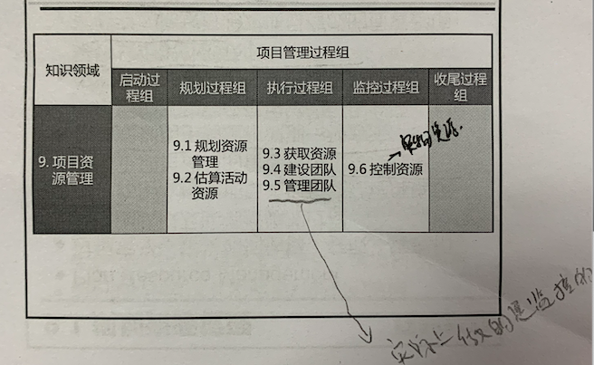
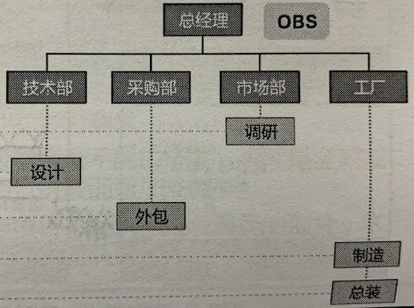
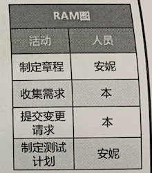
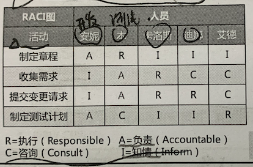
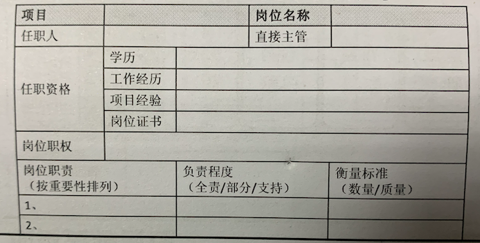

# 9 项目资源管理

宗旨：

在正确的时间 正确的地点 用正确的资源

资源主要分为实物资源(设备、材料和基础设置) 和 人力资源(团队资源)。

团队资源管理相比于实物资源管理，对项目经理提出了不同的技能和能力要求。

团队资源管理 和项目干系人管理有重叠的部分， 本章重点关注组成项目团队这部分的干系人。

项目经理应在获取、管理、激励和授权团队方面投入适当的努力。

项目经理负责建设高绩效团队。

事务资源着眼于以有效率有效果的方式，分配和使用 成功完成项目所需的实物资源。

不能有效管理 和 控制资源  是项目的风险来源之一。

发展趋势 和新型实践： 赋能。

敏捷考虑因素：    通才的自组织团队 以及 具有协作精神的团队。

过程构成：

## 9.1 规划资源管理

过程作用：

根据项目类型和复杂程度确定适用于项目资源的管理方法和管理程度。

资源规划用于确定和识别一种方法，以确保项目的成功有足够的可用资源。

资源可以从组织内部获得， 或者通过采购从外部获取。

需要考虑稀缺资源(人/物)对项目造成的显著影响

**数据表现：**

可通过多种格式来记录和阐明团队成员的角色和职责。

确保每个工作报告都有明确的责任人。

去报全体成员清楚理解其角色和职责。

主要三种形式：  层级性 、RAM  、文本型

层级型：(典型表现OBS(组织分解结构))

RAM型及 RACI(扩展图)：

旨在把所有工作落实到人

文本型：

**组织理论：**

组织理论阐述个人、团队和组织部分的行为方式。

不同的组织结构 展现不同的交际特点。

根据组织理论灵活运用领导风格。

**资源管理计划：**

提供了关于如何分类、分配、管理和释放项目资源的指南。

## 9.2 估算活动资源

## 9.3 获取资源

## 9.4 建设团队

## 9.5 管理团队

## 9.6 控制资源