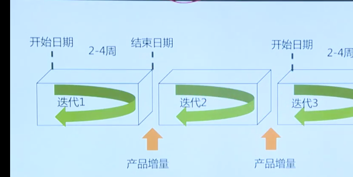
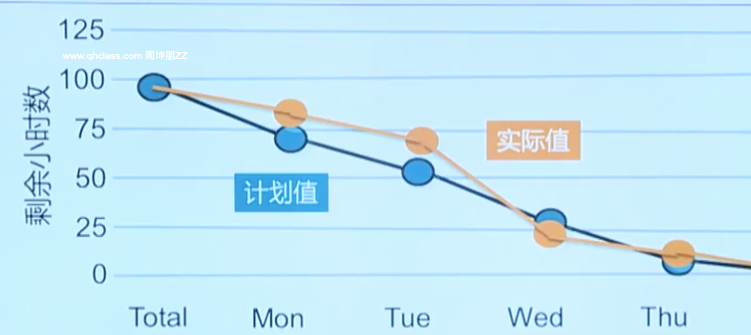
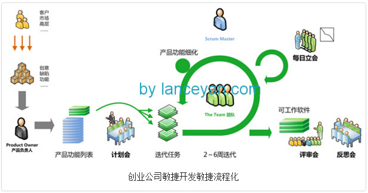
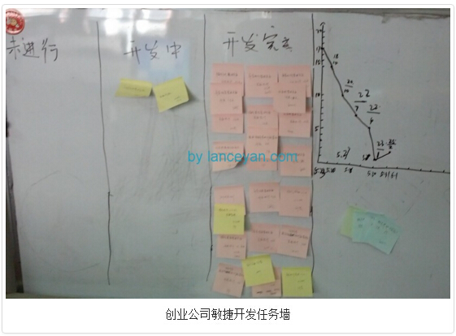

敏捷宣言：

- 个体和互动 高于 流程和工具
- 工作的软件  高于  详尽的文档
- 客户合作  高于  合同谈判
- 响应变化  高于 遵循计划

尽管后者有价值，但是我们更注重左边的价值。

敏捷以用户故事的形式书写需求。(以用户出发，  快速。)

众多的用户故事构成产品代办事项

在整个开发周期中持续不断的梳理代办事项。(加入 移除  删除  等)

敏捷中范围变更需要快速处理， 没有CCB， 产品负责人牵头，以团队讨论为主要方式：

- 加入产品代办事项
- 与其他需求排序
- 可以更改范围， 删除低优先级的功能
- 尽量保证进度和成本不变， 对范围进行调整。

敏捷以迭代(小步快跑)的形式开展工作，体现了渐进明细的思想。 在迭代开始前 从产品代办事项中选择下个迭代的工作

采用故事点数作为单位估算持续时间。点数大，代表工作量大。(比如版本1一共有200个故事点数，一个迭代能做20个故事点，那么一共需要10个迭代完成)

用迭代燃尽图展现剩余工作量：

敏捷中成本只进行轻量级估算，快速估算。   且 项目分批批准预算， 每一次发布进行拨款。

敏捷团队可以在不影响成本的情况下， 用高优先级需求 替换低优先级需求。保证了无论是项目 开始 还是结束，只关注客户真正需要的功能上。

对于敏捷中的风险管理：
持续检查产品增量， 了解其风险。 
选择迭代工作时，考虑风险。 （迭代规划会 ）
定性分析在迭代开始前进行。  通常无 定量分析。 

敏捷中的采购管理：
敏捷中优先选择风险共担的合同类型。通常采用主体协议+ 补充协议的形式   （成本补偿合同   工料合同）   
共担风险  共享奖励。       
在总预算不变的前提下， 变更免费。  （抛弃低优先级的 增加高优先级的）  
实现商业价值后， 可提前中止。

敏捷中主要的角色：

敏捷教练(scrum master) -- 实施敏捷方法

产品负责人(product owner) -- 整理产品功能优先级，维护产品backlog，代表客户利益。

开发团队(team)  - 一群跨职能的 专注的 全能的小伙伴(通用的专才)， 负责估算时间/成本,  提供解决方案并交付产品，彼此信赖，自组织的工作。

敏捷中倡导面对面沟通 ，透明，其具有最高的水平带宽，可以在单位时间内传递最多的信息。   最好有白板(信息辐射源)。当干系人问项目进展时，可以展示白板。

(面对面+白板 > 面对面  > 视频会议 > 电话会议   )

几个常见的会议：

迭代规划会： 为本次迭代规划工作内容。

每日站会：  团队成员同步工作进展信息， 昨天做了什么， 今天打算做什么， 遇到了什么问题。(产品负责人无需参加)

迭代评审会：   评审迭代成果，寻求客户、发起人 产品负责人反馈。 

回顾会议：   反思工作过程，团队持续改进工作方式。 

敏捷开发简单流程：

1. 产品负责人把产品设计为产品backlog(产品代办事项)， 产品backlog是一个需求列表。
2. 召开 产品**backlog计划会议(迭代规划会)**，预估每个backlog的时间，确定哪些backlog是需要在第一个sprint中完成的，即sprint的backlog
3. 把sprint会议上确定的 backlog写在纸条上，贴在任务墙上， 让大家认领。
4. 举行 每日站会， 互相了解进度  沟通问题。时间控制在15分钟内。
5. 绘制燃尽图， 保证本次迭代的情况可以看到。(每天看到任务还剩多少，直到任务数为0)
6. 迭代完成后， 迭代评审会 。演示成果，获取反馈。  
7. 回顾总结会议。轮流发言，总结上个sprint遇到的问题，大家一起讨论。

任务墙样例：

