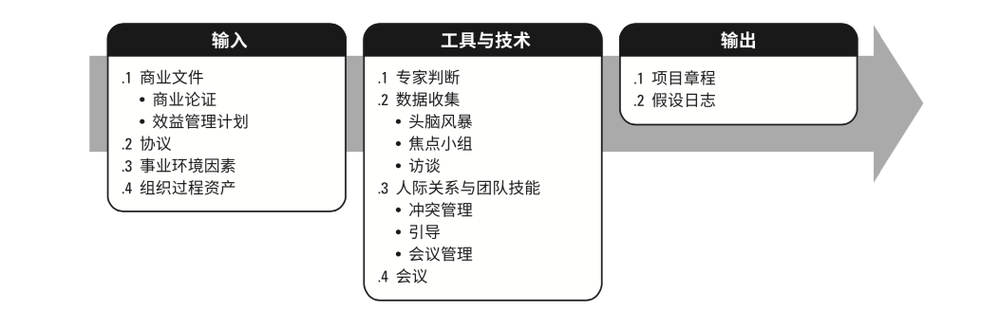
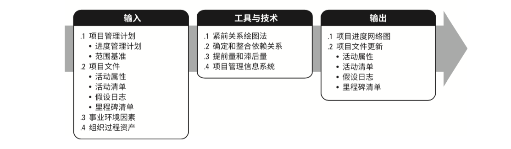
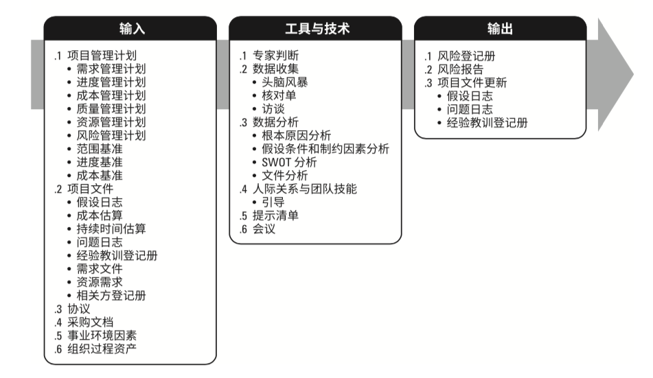
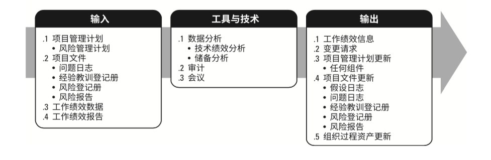

# 整合ITTO

4.1 制定项目章程

4.2 制定项目管理计划

4.2 指导管理项目工作

4.4 管理项目知识

4.5 监督项目工作

4.6 实施整体变更控制

4.7 结束项目或阶段

5.1规划范围管理

5.2 收集需求

5.3 定义范围

5.4 创建WBS

5.6 控制范围

5.5 确认范围

6.1 规划进度管理

6.2 定义活动

6.3 排列活动顺序

6.4 估算活动持续时间

6.5 制定进度计划

6.6 控制进度

7.1 规划成本管理

7.2 估算成本

7.3 制定预算

7.4 控制成本

8.1 规划质量管理

8.2 管理质量

8.3 控制质量

资源沟通干系人风险采购

9.1 规划资源管理

9.2 估算活动资源

9.3  获取资源

9.4 建设团队

9.5 管理团队

9.6 控制资源

10.1 规划沟通管理

10.2 管理沟通

10.3 监督沟通

13.1 识别干系人

13.2  规划干系人参与

13.3 管理干系人参与

13.4监督干系人参与

11.1 规划风险管理

11.2 识别风险

11.3 实施风险定性分析

11.4 实施风险定量分析

11.5 规划风险应对

11.6 实施风险应对

11.7 监督风险

12.1 规划采购管理

12.2  实施采购

12.3  控制采购

